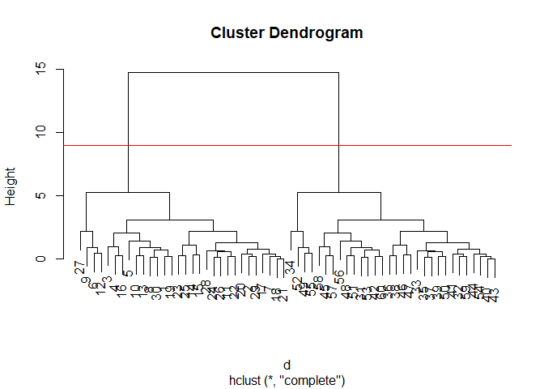
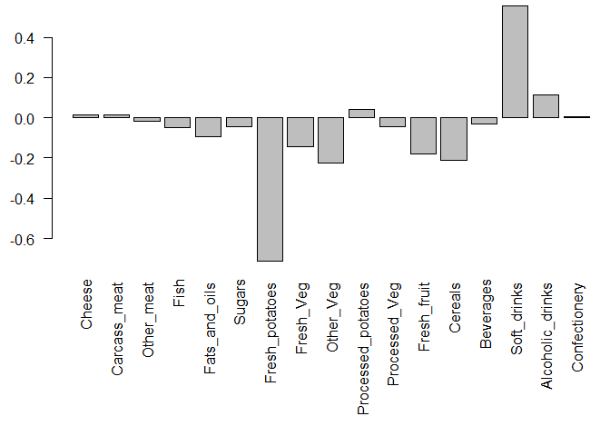
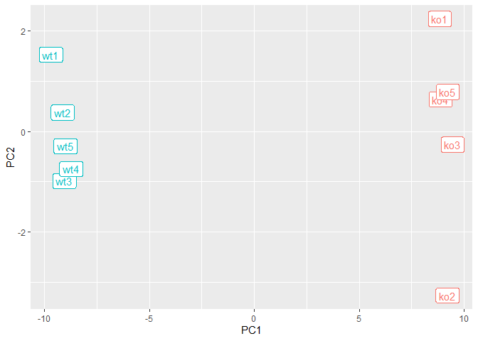

# Class 7: Hands on with Principal Component Analysis (PCA)
Georgina Canto-Encalada (A59021295)

Today we are going to explore some core machine learning methods. Namely
clustering and dimensionality

\#Kmeans clustering

The main function for k-means in “base” R is called `kmeans()`. Let’s
first make up some data to see how kmeans works and to get at the
results.

``` r
hist(rnorm(50000))
```


``` r
hist(rnorm(50000,mean=3))
```


Make a vector with 60 total points, half centered at +3 and half at -3

``` r
a<-rnorm(30,mean=3)
b<-rnorm(30,mean=-3)
c<-c(a,b)
c
```

     [1]  2.41752065  3.18762970  3.63195613  3.46743258  4.60694858  0.81657340
     [7]  1.32846224  2.64447639  4.13277707  5.31957068  2.90313589  3.30876415
    [13]  3.98538636  2.90480233  0.86034424  2.98764149  4.82294105  3.23585208
    [19]  2.18267484  2.65782116  3.00445627  2.07946480  2.59537757  0.95851723
    [25]  2.49165454  1.86262127  3.20175287  3.52565222  4.19207413  3.55524581
    [31] -3.21907884 -1.93089006 -2.05705903 -3.64931732 -3.30426642 -2.13024632
    [37] -2.94988280 -2.45892125 -1.82814941 -2.69331393 -1.65695385 -4.68526046
    [43] -2.58699618 -2.25821199 -2.26999632 -1.92703744 -3.26980698 -2.84408224
    [49] -2.92358631 -1.95564768 -5.45089133  0.02127122 -2.30798853 -2.81666876
    [55] -2.18384783 -2.70400361 -2.31828221 -3.95980513 -3.82465294 -2.67596649

Can shorten code ading this way.

``` r
tmp<-c(rnorm(30,3),rnorm(30,-3))
```

Get the reverse to make another vector

``` r
x<-cbind(tmp,y=rev(tmp))
plot(x)
```


Now run the kmeans function to see how they cluster

``` r
k<-kmeans(x,centers=2,nstart=20)
k
```

    K-means clustering with 2 clusters of sizes 30, 30

    Cluster means:
            tmp         y
    1  2.911971 -2.787478
    2 -2.787478  2.911971

    Clustering vector:
     [1] 1 1 1 1 1 1 1 1 1 1 1 1 1 1 1 1 1 1 1 1 1 1 1 1 1 1 1 1 1 1 2 2 2 2 2 2 2 2
    [39] 2 2 2 2 2 2 2 2 2 2 2 2 2 2 2 2 2 2 2 2 2 2

    Within cluster sum of squares by cluster:
    [1] 48.68765 48.68765
     (between_SS / total_SS =  90.9 %)

    Available components:

    [1] "cluster"      "centers"      "totss"        "withinss"     "tot.withinss"
    [6] "betweenss"    "size"         "iter"         "ifault"      

Whats in this results?

``` r
attributes(k)
```

    $names
    [1] "cluster"      "centers"      "totss"        "withinss"     "tot.withinss"
    [6] "betweenss"    "size"         "iter"         "ifault"      

    $class
    [1] "kmeans"

What are the cluster centers?

``` r
k$centers
```

            tmp         y
    1  2.911971 -2.787478
    2 -2.787478  2.911971

What are the clustering results?

``` r
k$cluster
```

     [1] 1 1 1 1 1 1 1 1 1 1 1 1 1 1 1 1 1 1 1 1 1 1 1 1 1 1 1 1 1 1 2 2 2 2 2 2 2 2
    [39] 2 2 2 2 2 2 2 2 2 2 2 2 2 2 2 2 2 2 2 2 2 2

Q. Plot your data “x” showing your clustering results and the center
point for each cluster?

``` r
plot(x,col=k$cluster)
```


> Q. Run kmeans and cluster into 3 groups and plot thre results

``` r
k2<-kmeans(x,centers=3,nstart=20)
k2
```

    K-means clustering with 3 clusters of sizes 11, 19, 30

    Cluster means:
            tmp         y
    1 -3.342154  3.846053
    2 -2.466350  2.371186
    3  2.911971 -2.787478

    Clustering vector:
     [1] 3 3 3 3 3 3 3 3 3 3 3 3 3 3 3 3 3 3 3 3 3 3 3 3 3 3 3 3 3 3 1 2 2 1 2 2 2 2
    [39] 2 2 2 1 2 2 2 2 2 1 1 2 1 1 1 2 1 1 2 2 2 1

    Within cluster sum of squares by cluster:
    [1] 15.52667 12.66320 48.68765
     (between_SS / total_SS =  92.8 %)

    Available components:

    [1] "cluster"      "centers"      "totss"        "withinss"     "tot.withinss"
    [6] "betweenss"    "size"         "iter"         "ifault"      

``` r
plot(x,col=k2$cluster)
```


The big limitations of kmeans is that it imposes a structure on your
data (it will force your data to fit your told it to, aka, not real).
Process requires arbitrarily but sistematcally (manually) applying until
you find the best one.

# Hierarchical Clustering

The main function in “base” R for this is called `hlcust()`. It wants a
distance matrix as input not the data itself.

We can calculate a distance matrix in lots of different ways but here we
will use the `dist()` function.

``` r
d<-dist(x)
hc<-hclust(d)
hc
```


    Call:
    hclust(d = d)

    Cluster method   : complete 
    Distance         : euclidean 
    Number of objects: 60 

There is a specific plot

``` r
plot(hc)
abline(h=9,col="red")
```



To get the cluster membership vector we nee to “cut” the tree at a given
height that we pick. The function to do this is called `cutree()`

``` r
cutree(hc, h=9)
```

     [1] 1 1 1 1 1 1 1 1 1 1 1 1 1 1 1 1 1 1 1 1 1 1 1 1 1 1 1 1 1 1 2 2 2 2 2 2 2 2
    [39] 2 2 2 2 2 2 2 2 2 2 2 2 2 2 2 2 2 2 2 2 2 2

``` r
cutree(hc, k=4)
```

     [1] 1 1 1 1 1 2 1 1 2 1 1 2 1 1 1 1 1 1 1 1 1 1 1 1 1 1 2 1 1 1 3 3 3 4 3 3 3 3
    [39] 3 3 3 3 3 3 3 3 3 3 4 3 3 4 3 3 4 3 3 3 3 3

``` r
grps<-cutree(hc, k=2)
```

> Q. Plot our data(`x`) colored by our hclust result.

``` r
plot(x,col=grps)
```


# Data import

## Principal Component Analysis (PCA)

We will start with PCA of a tiny tiny datase and make fun of stuff barry
eats

``` r
url <- "https://tinyurl.com/UK-foods"
x <- read.csv(url)
```

One useful plot in this case (because we only have 4 countries to look
across) is a so called pairse plot

> Q1. How many rows and columns are in your new data frame named x? What
> R functions could you use to answer this questions?

ANS: x has 17 rows and 5 columns

``` r
dim(x)
```

    [1] 17  5

``` r
nrow(x)
```

    [1] 17

``` r
ncol(x)
```

    [1] 5

# Checking your data

``` r
## Preview the first 6 rows
head(x,6)
```

                   X England Wales Scotland N.Ireland
    1         Cheese     105   103      103        66
    2  Carcass_meat      245   227      242       267
    3    Other_meat      685   803      750       586
    4           Fish     147   160      122        93
    5 Fats_and_oils      193   235      184       209
    6         Sugars     156   175      147       139

Hmm, it looks like the row-names here were not set properly as we were
expecting 4 columns (one for each of the 4 countries of the UK - not 5
as reported from the dim() function).

Here it appears that the row-names are incorrectly set as the first
column of our x data frame (rather than set as proper row-names). This
is very common and sometimes what we want - but not in this case. Lets
try to fix this up with the following code, which sets the rownames() to
the first column and then removes the troublesome first column (with the
-1 column index):

``` r
# Note how the minus indexing works
rownames(x) <- x[,1]
x <- x[,-1]
head(x)
```

                   England Wales Scotland N.Ireland
    Cheese             105   103      103        66
    Carcass_meat       245   227      242       267
    Other_meat         685   803      750       586
    Fish               147   160      122        93
    Fats_and_oils      193   235      184       209
    Sugars             156   175      147       139

lets check the dimensions again:

``` r
dim(x)
```

    [1] 17  4

An alternative approach to setting the correct row-names in this case
would be to read the data filie again and this time set the row.names
argument of read.csv() to be the first column (i.e. use argument setting
row.names=1), see below:

``` r
x <- read.csv(url, row.names=1)
head(x)
```

                   England Wales Scotland N.Ireland
    Cheese             105   103      103        66
    Carcass_meat       245   227      242       267
    Other_meat         685   803      750       586
    Fish               147   160      122        93
    Fats_and_oils      193   235      184       209
    Sugars             156   175      147       139

Q2. Which approach to solving the ‘row-names problem’ mentioned above do
you prefer and why? Is one approach more robust than another under
certain circumstances?

ANS: I prefer to use the row.names argument of read.csv() since it
requires less coding lines

# Spotting major differences and trends

A cursory glance over the numbers in this table does not reveal much of
anything. Indeed in general it is difficult to extract meaning in regard
to major differences and trends from any given array of numbers.
Generating regular bar-plots and various pairwise plots does not help
too much either:

``` r
barplot(as.matrix(x), beside=T, col=rainbow(nrow(x)))
```


> Q3: Changing what optional argument in the above barplot() function
> results in the following plot?

ANS: Changing the “beside” argument from TRUE to FALSE

``` r
barplot(as.matrix(x), beside=F, col=rainbow(nrow(x)))
```


> Q5: Generating all pairwise plots may help somewhat. Can you make
> sense of the following code and resulting figure? What does it mean if
> a given point lies on the diagonal for a given plot?

ANS:Each scatterplot below or above the diagonal represents the
relationship between two regions. For example, the scatterplot in the
first column and second row compares the values for England (x-axis) and
Wales (y-axis). The argument color set as “rainbow” assigns a color to a
type of food (for example, yellow=cheese, green=Carcass_meat, etc.). The
pch parameter stands for “plotting character” or “point character”.
Finally, each point in a plot represents the comparison of the
consumption of different types of food between two regions. If a point
lies on the diagonal of a given plot it means that both regions consume
the same amount of a specific type of food.

``` r
pairs(x, col=rainbow(10), pch=16)
```


> Q6. What is the main differences between N. Ireland and the other
> countries of the UK in terms of this data-set?

ANS: N. Ireland consumes more fresh potatoes and soft drinks than other
countries, which it seems to correspond to the dark blue and orange
points in the scatterplots aligned to the N.Ireland column. These point
are located very far from the diagonal.

## Enter PCA

The main function to do PCA in “base” R is called `prcomp()`.

It wants our food as the columns and the countries as the rows. It
basically wants the tanspose of the data we have

``` r
# Use the prcomp() PCA function 
pca<-prcomp(t(x))
summary(pca)
```

    Importance of components:
                                PC1      PC2      PC3       PC4
    Standard deviation     324.1502 212.7478 73.87622 3.176e-14
    Proportion of Variance   0.6744   0.2905  0.03503 0.000e+00
    Cumulative Proportion    0.6744   0.9650  1.00000 1.000e+00

``` r
attributes(pca)
```

    $names
    [1] "sdev"     "rotation" "center"   "scale"    "x"       

    $class
    [1] "prcomp"

``` r
pca$x
```

                     PC1         PC2        PC3           PC4
    England   -144.99315   -2.532999 105.768945 -4.894696e-14
    Wales     -240.52915 -224.646925 -56.475555  5.700024e-13
    Scotland   -91.86934  286.081786 -44.415495 -7.460785e-13
    N.Ireland  477.39164  -58.901862  -4.877895  2.321303e-13

> Q7. Complete the code below to generate a plot of PC1 vs PC2. The
> second line adds text labels over the data points.

``` r
plot(pca$x[,1],pca$x[,2],xlab="PC1 (67.4%)",ylab="PC2(29%)", xlim=c(-270,500))
text(pca$x[,1], pca$x[,2], colnames(x))
```


> Q8. Customize your plot so that the colors of the country names match
> the colors in our UK and Ireland map and table at start of this
> document.

``` r
plot(pca$x[,1],pca$x[,2],xlab="PC1 (67.4%)",ylab="PC2(29%)", xlim=c(-270,500))
text(pca$x[,1], pca$x[,2], colnames(x),col=c("orange","red","blue","darkgreen"))
```


Once the principal components have been obtained, we can use them to map
the relationship between variables (i.e. countries) in therms of these
major PCs (i.e. new axis that maximally describe the original data
variance).

As part of the PCA method, we automatically obtain information about the
contributions of each principal component to the total variance of the
coordinates. This is typically contained in the Eigenvectors returned
from such calculations. In the prcomp() function we can use the
summary() command above or examine the returned pca\$sdev

``` r
v <- round( pca$sdev^2/sum(pca$sdev^2) * 100 )
v
```

    [1] 67 29  4  0

``` r
## or the second row here...
z <- summary(pca)
z$importance
```

                                 PC1       PC2      PC3          PC4
    Standard deviation     324.15019 212.74780 73.87622 3.175833e-14
    Proportion of Variance   0.67444   0.29052  0.03503 0.000000e+00
    Cumulative Proportion    0.67444   0.96497  1.00000 1.000000e+00

This information can be summarized in a plot of the variances
(eigenvalues) with respect to the principal component number
(eigenvector number), which is given below.

``` r
barplot(v, xlab="Principal Component", ylab="Percent Variation")
```


# Digging deeper (variable loadings)

We can also consider the influence of each of the original variables
upon the principal components (typically known as loading scores). This
information can be obtained from the prcomp() returned \$rotation
component. It can also be summarized with a call to biplot(), see below:

``` r
## Lets focus on PC1 as it accounts for > 90% of variance 
par(mar=c(10, 3, 0.35, 0))
barplot( pca$rotation[,1], las=2 )
```


Here we see observations (foods) with the largest positive loading
scores that effectively “push” N. Ireland to right positive side of the
plot (including Fresh_potatoes and Soft_drinks).

We can also see the observations/foods with high negative scores that
push the other countries to the left side of the plot (including
Fresh_fruit and Alcoholic_drinks).

> Q9: Generate a similar ‘loadings plot’ for PC2. What two food groups
> feature prominantely and what does PC2 maninly tell us about?

ANS: While Fresh-potatoes are in the negative side of the plot, soft
drinks are in the positive side. The PC2 shows that there are more
variance between these two groups. However, it does not show alcoholic
drinks and fresh fruit as predominant food like PC1 does.

``` r
## Lets focus on PC2
par(mar=c(10, 3, 0.35, 0))
barplot( pca$rotation[,2], las=2 )
```



# Using ggplot for these figures

``` r
library(ggplot2)

df <- as.data.frame(pca$x)
df_lab <- tibble::rownames_to_column(df, "Country")

# Our first basic plot
ggplot(df_lab) + 
  aes(PC1, PC2, col=Country) + 
  geom_point()
```


And then we can get carried away and make this look much nicer:

``` r
ggplot(df_lab) + 
  aes(PC1, PC2, col=Country, label=Country) + 
  geom_hline(yintercept = 0, col="gray") +
  geom_vline(xintercept = 0, col="gray") +
  geom_point(show.legend = FALSE) +
  geom_label(hjust=1, nudge_x = -10, show.legend = FALSE) +
  expand_limits(x = c(-300,500)) +
  xlab("PC1 (67.4%)") +
  ylab("PC2 (28%)") +
  theme_bw()
```


Let’s do the same for our loadings/PC contributions figures. This data
is stored in the pca\$rotation object that we convert to a data frame,
add the useful row names as a new column and then plot and customize
with additional ggplot layers. Which do you prefer, base graphics or
ggplot?

``` r
ld <- as.data.frame(pca$rotation)
ld_lab <- tibble::rownames_to_column(ld, "Food")

ggplot(ld_lab) +
  aes(PC1, Food) +
  geom_col() 
```


We can now add some additional features to the plot, such as reordering
the y axis by the PC1 loadings and selecting a rather ugly color scale
(to match our country colors) and our prefered theme layer.

``` r
ggplot(ld_lab) +
  aes(PC1, reorder(Food, PC1), bg=PC1) +
  geom_col() + 
  xlab("PC1 Loadings/Contributions") +
  ylab("Food Group") +
  scale_fill_gradient2(low="purple", mid="gray", high="darkgreen", guide=NULL) +
  theme_bw()
```


## Biplots

Another way to see this information together with the main PCA plot is
in a so-called biplot:

``` r
## The inbuilt biplot() can be useful for small datasets 
biplot(pca)
```


# 2. PCA of RNA-seq data

In this example, a small RNA-seq count data set (available from the
class website (expression.csv and the tinyurl short link:
“https://tinyurl.com/expression-CSV” ) is read into a data frame called
rna.data where the columns are individual samples (i.e. cells) and rows
are measurements taken for all the samples (i.e. genes).

``` r
url2 <- "https://tinyurl.com/expression-CSV"
rna.data <- read.csv(url2, row.names=1)
head(rna.data)
```

           wt1 wt2  wt3  wt4 wt5 ko1 ko2 ko3 ko4 ko5
    gene1  439 458  408  429 420  90  88  86  90  93
    gene2  219 200  204  210 187 427 423 434 433 426
    gene3 1006 989 1030 1017 973 252 237 238 226 210
    gene4  783 792  829  856 760 849 856 835 885 894
    gene5  181 249  204  244 225 277 305 272 270 279
    gene6  460 502  491  491 493 612 594 577 618 638

> Q10: How many genes and samples are in this data set?

ANS: 100 genes and 10 samples

``` r
dim(rna.data)
```

    [1] 100  10

Generating barplots etc. to make sense of this data is really not an
exciting or worthwhile option to consider. So lets do PCA and plot the
results:

``` r
## Again we have to take the transpose of our data 
pca <- prcomp(t(rna.data), scale=TRUE)
 
## Simple un polished plot of pc1 and pc2
plot(pca$x[,1], pca$x[,2], xlab="PC1", ylab="PC2")
```


This quick plot looks interesting with a nice separation of samples into
two groups of 5 samples each. Before delving into the details of this
grouping let’s first examine a summary of how much variation in the
original data each PC accounts for:

``` r
summary(pca)
```

    Importance of components:
                              PC1    PC2     PC3     PC4     PC5     PC6     PC7
    Standard deviation     9.6237 1.5198 1.05787 1.05203 0.88062 0.82545 0.80111
    Proportion of Variance 0.9262 0.0231 0.01119 0.01107 0.00775 0.00681 0.00642
    Cumulative Proportion  0.9262 0.9493 0.96045 0.97152 0.97928 0.98609 0.99251
                               PC8     PC9      PC10
    Standard deviation     0.62065 0.60342 3.457e-15
    Proportion of Variance 0.00385 0.00364 0.000e+00
    Cumulative Proportion  0.99636 1.00000 1.000e+00

A quick barplot summary of this Proportion of Variance for each PC can
be obtained by calling the plot() function directly on our prcomp result
object.

``` r
plot(pca, main="Quick screen plot")
```


Let’s make the above scree plot ourselves and in so doing explore the
object returned from prcomp() a little further. We can use the square of
pca\$sdev, which stands for “standard deviation”, to calculate how much
variation in the original data each PC accounts for:

``` r
## Variance captured per PC 
pca.var <- pca$sdev^2

## Percent variance is often more informative to look at 
pca.var.per <- round(pca.var/sum(pca.var)*100, 1)
pca.var.per
```

     [1] 92.6  2.3  1.1  1.1  0.8  0.7  0.6  0.4  0.4  0.0

We can use this to generate our own screen-plot like this:

``` r
barplot(pca.var.per, main="Screen Plot", 
        names.arg = paste0("PC", 1:10),
        xlab="Principal Component", ylab="Percent Variation")
```


Now lets make our main PCA plot a bit more attractive and useful…

``` r
## A vector of colors for wt and ko samples
colvec <- colnames(rna.data)
colvec[grep("wt", colvec)] <- "red"
colvec[grep("ko", colvec)] <- "blue"

plot(pca$x[,1], pca$x[,2], col=colvec, pch=16,
     xlab=paste0("PC1 (", pca.var.per[1], "%)"),
     ylab=paste0("PC2 (", pca.var.per[2], "%)"))

text(pca$x[,1], pca$x[,2], labels = colnames(rna.data), pos=c(rep(4,5), rep(2,5)))
```


## Using ggplot

``` r
library(ggplot2)

df <- as.data.frame(pca$x)

# Our first basic plot
ggplot(df) + 
  aes(PC1, PC2) + 
  geom_point()
```


If we want to add a condition specific color and perhaps sample label
aesthetics for wild-type and knock-out samples we will need to have this
information added to our data.frame:

``` r
# Add a 'wt' and 'ko' "condition" column
df$samples <- colnames(rna.data) 
df$condition <- substr(colnames(rna.data),1,2)

p <- ggplot(df) + 
        aes(PC1, PC2, label=samples, col=condition) + 
        geom_label(show.legend = FALSE)
p
```



And finally add some spit and polish

``` r
p + labs(title="PCA of RNASeq Data",
       subtitle = "PC1 clealy seperates wild-type from knock-out samples",
       x=paste0("PC1 (", pca.var.per[1], "%)"),
       y=paste0("PC2 (", pca.var.per[2], "%)"),
       caption="Class example data") +
     theme_bw()
```


## Optional: Gene loadings

``` r
loading_scores <- pca$rotation[,1]

## Find the top 10 measurements (genes) that contribute
## most to PC1 in either direction (+ or -)
gene_scores <- abs(loading_scores) 
gene_score_ranked <- sort(gene_scores, decreasing=TRUE)

## show the names of the top 10 genes
top_10_genes <- names(gene_score_ranked[1:10])
top_10_genes 
```

     [1] "gene100" "gene66"  "gene45"  "gene68"  "gene98"  "gene60"  "gene21" 
     [8] "gene56"  "gene10"  "gene90" 
