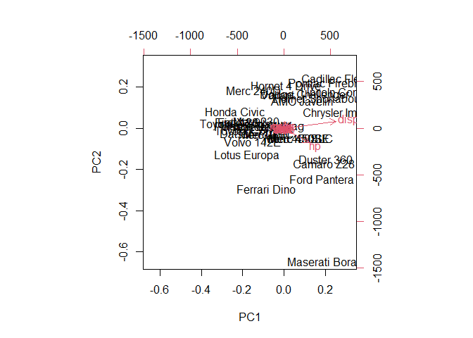
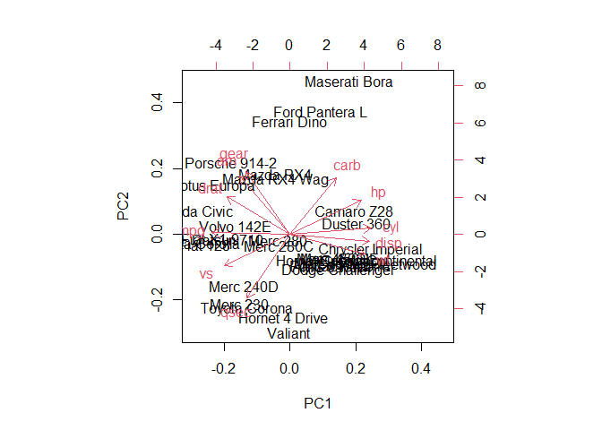
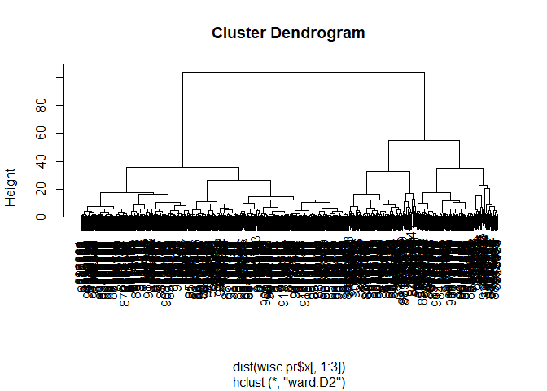
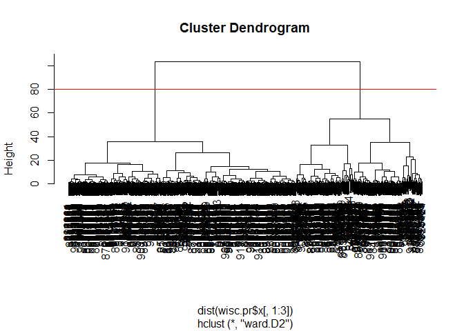
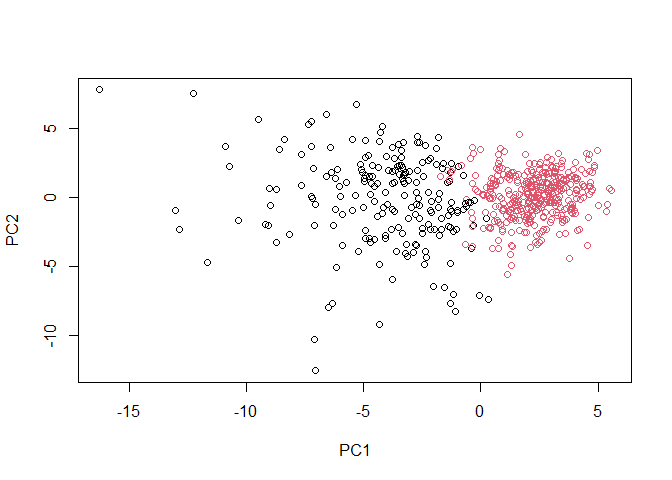
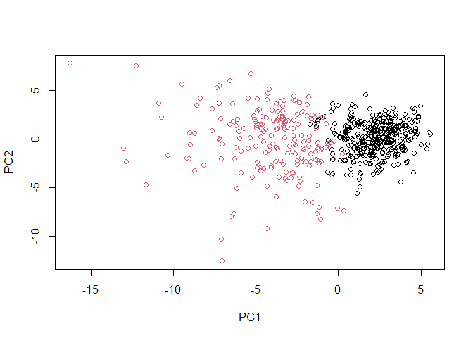
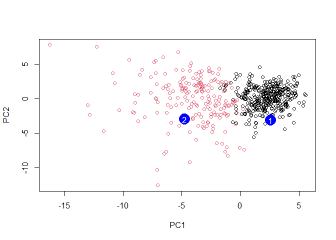

# Class 8 Mini-Project: Unsupervised Learning Analysis of Human Breast
Cancer Cells
Georgina Canto-Encalada (A59021295)

The goal of this miniproject is for you to explore a complete analysis
using the unsupervised learning techniques covered in class. You will
extend what you’ve learned by combinding PCA as a preprocessing step to
clustering using data that consist of measurements of cell nuclei of
human breast masses:

Our data from today come for FNA of breast tissue

``` r
# Save your input data file into your Project directory
fna.data <- "WisconsinCancer.csv"

# Complete the following code to input the data and store as wisc.df
wisc.df <- read.csv(fna.data, row.names=1)
head(wisc.df)
```

             diagnosis radius_mean texture_mean perimeter_mean area_mean
    842302           M       17.99        10.38         122.80    1001.0
    842517           M       20.57        17.77         132.90    1326.0
    84300903         M       19.69        21.25         130.00    1203.0
    84348301         M       11.42        20.38          77.58     386.1
    84358402         M       20.29        14.34         135.10    1297.0
    843786           M       12.45        15.70          82.57     477.1
             smoothness_mean compactness_mean concavity_mean concave.points_mean
    842302           0.11840          0.27760         0.3001             0.14710
    842517           0.08474          0.07864         0.0869             0.07017
    84300903         0.10960          0.15990         0.1974             0.12790
    84348301         0.14250          0.28390         0.2414             0.10520
    84358402         0.10030          0.13280         0.1980             0.10430
    843786           0.12780          0.17000         0.1578             0.08089
             symmetry_mean fractal_dimension_mean radius_se texture_se perimeter_se
    842302          0.2419                0.07871    1.0950     0.9053        8.589
    842517          0.1812                0.05667    0.5435     0.7339        3.398
    84300903        0.2069                0.05999    0.7456     0.7869        4.585
    84348301        0.2597                0.09744    0.4956     1.1560        3.445
    84358402        0.1809                0.05883    0.7572     0.7813        5.438
    843786          0.2087                0.07613    0.3345     0.8902        2.217
             area_se smoothness_se compactness_se concavity_se concave.points_se
    842302    153.40      0.006399        0.04904      0.05373           0.01587
    842517     74.08      0.005225        0.01308      0.01860           0.01340
    84300903   94.03      0.006150        0.04006      0.03832           0.02058
    84348301   27.23      0.009110        0.07458      0.05661           0.01867
    84358402   94.44      0.011490        0.02461      0.05688           0.01885
    843786     27.19      0.007510        0.03345      0.03672           0.01137
             symmetry_se fractal_dimension_se radius_worst texture_worst
    842302       0.03003             0.006193        25.38         17.33
    842517       0.01389             0.003532        24.99         23.41
    84300903     0.02250             0.004571        23.57         25.53
    84348301     0.05963             0.009208        14.91         26.50
    84358402     0.01756             0.005115        22.54         16.67
    843786       0.02165             0.005082        15.47         23.75
             perimeter_worst area_worst smoothness_worst compactness_worst
    842302            184.60     2019.0           0.1622            0.6656
    842517            158.80     1956.0           0.1238            0.1866
    84300903          152.50     1709.0           0.1444            0.4245
    84348301           98.87      567.7           0.2098            0.8663
    84358402          152.20     1575.0           0.1374            0.2050
    843786            103.40      741.6           0.1791            0.5249
             concavity_worst concave.points_worst symmetry_worst
    842302            0.7119               0.2654         0.4601
    842517            0.2416               0.1860         0.2750
    84300903          0.4504               0.2430         0.3613
    84348301          0.6869               0.2575         0.6638
    84358402          0.4000               0.1625         0.2364
    843786            0.5355               0.1741         0.3985
             fractal_dimension_worst
    842302                   0.11890
    842517                   0.08902
    84300903                 0.08758
    84348301                 0.17300
    84358402                 0.07678
    843786                   0.12440

> Q1. How many observations are in this dataset?

There are 569 individuals in this dataset

> Q2. What is in the `$diagnosis` column? How many of each type?

ANS: We have 357 benignant diagnosis and 212 malignant diagnosis.

``` r
# One approach
sum(wisc.df$diagnosis=="M")
```

    [1] 212

``` r
sum(wisc.df$diagnosis=="B")
```

    [1] 357

``` r
#Other approach using `table()`

table(wisc.df$diagnosis)
```


      B   M 
    357 212 

> Q3.How many variables/features in the data are suffixed with \_mean?

``` r
length(grep("_mean",colnames(wisc.df),value="TRUE"))
```

    [1] 10

> Q3.How many variables/dimensions have we?

``` r
ncol(wisc.df)
```

    [1] 31

Save the diagnosis for reference later

``` r
diagnosis<- as.factor(wisc.df$diagnosis)
```

and remove or exclude this column form any of our analysis

``` r
wisc.data<-wisc.df[,-1]
head(wisc.data)
```

             radius_mean texture_mean perimeter_mean area_mean smoothness_mean
    842302         17.99        10.38         122.80    1001.0         0.11840
    842517         20.57        17.77         132.90    1326.0         0.08474
    84300903       19.69        21.25         130.00    1203.0         0.10960
    84348301       11.42        20.38          77.58     386.1         0.14250
    84358402       20.29        14.34         135.10    1297.0         0.10030
    843786         12.45        15.70          82.57     477.1         0.12780
             compactness_mean concavity_mean concave.points_mean symmetry_mean
    842302            0.27760         0.3001             0.14710        0.2419
    842517            0.07864         0.0869             0.07017        0.1812
    84300903          0.15990         0.1974             0.12790        0.2069
    84348301          0.28390         0.2414             0.10520        0.2597
    84358402          0.13280         0.1980             0.10430        0.1809
    843786            0.17000         0.1578             0.08089        0.2087
             fractal_dimension_mean radius_se texture_se perimeter_se area_se
    842302                  0.07871    1.0950     0.9053        8.589  153.40
    842517                  0.05667    0.5435     0.7339        3.398   74.08
    84300903                0.05999    0.7456     0.7869        4.585   94.03
    84348301                0.09744    0.4956     1.1560        3.445   27.23
    84358402                0.05883    0.7572     0.7813        5.438   94.44
    843786                  0.07613    0.3345     0.8902        2.217   27.19
             smoothness_se compactness_se concavity_se concave.points_se
    842302        0.006399        0.04904      0.05373           0.01587
    842517        0.005225        0.01308      0.01860           0.01340
    84300903      0.006150        0.04006      0.03832           0.02058
    84348301      0.009110        0.07458      0.05661           0.01867
    84358402      0.011490        0.02461      0.05688           0.01885
    843786        0.007510        0.03345      0.03672           0.01137
             symmetry_se fractal_dimension_se radius_worst texture_worst
    842302       0.03003             0.006193        25.38         17.33
    842517       0.01389             0.003532        24.99         23.41
    84300903     0.02250             0.004571        23.57         25.53
    84348301     0.05963             0.009208        14.91         26.50
    84358402     0.01756             0.005115        22.54         16.67
    843786       0.02165             0.005082        15.47         23.75
             perimeter_worst area_worst smoothness_worst compactness_worst
    842302            184.60     2019.0           0.1622            0.6656
    842517            158.80     1956.0           0.1238            0.1866
    84300903          152.50     1709.0           0.1444            0.4245
    84348301           98.87      567.7           0.2098            0.8663
    84358402          152.20     1575.0           0.1374            0.2050
    843786            103.40      741.6           0.1791            0.5249
             concavity_worst concave.points_worst symmetry_worst
    842302            0.7119               0.2654         0.4601
    842517            0.2416               0.1860         0.2750
    84300903          0.4504               0.2430         0.3613
    84348301          0.6869               0.2575         0.6638
    84358402          0.4000               0.1625         0.2364
    843786            0.5355               0.1741         0.3985
             fractal_dimension_worst
    842302                   0.11890
    842517                   0.08902
    84300903                 0.08758
    84348301                 0.17300
    84358402                 0.07678
    843786                   0.12440

Let’s try clustering this data:

Hierachical clustering with `hclust()`

``` r
wisc.hc <- hclust(dist(wisc.data))
plot(wisc.hc)
```


# Principal Coponent Analysis (PCA)

Let’s try PCA on this data. Before doing any analysis like this, we
should check if our input data needs to be scaled first.

Side-note:

``` r
head(mtcars)
```

                       mpg cyl disp  hp drat    wt  qsec vs am gear carb
    Mazda RX4         21.0   6  160 110 3.90 2.620 16.46  0  1    4    4
    Mazda RX4 Wag     21.0   6  160 110 3.90 2.875 17.02  0  1    4    4
    Datsun 710        22.8   4  108  93 3.85 2.320 18.61  1  1    4    1
    Hornet 4 Drive    21.4   6  258 110 3.08 3.215 19.44  1  0    3    1
    Hornet Sportabout 18.7   8  360 175 3.15 3.440 17.02  0  0    3    2
    Valiant           18.1   6  225 105 2.76 3.460 20.22  1  0    3    1

``` r
apply(mtcars,2,mean)
```

           mpg        cyl       disp         hp       drat         wt       qsec 
     20.090625   6.187500 230.721875 146.687500   3.596563   3.217250  17.848750 
            vs         am       gear       carb 
      0.437500   0.406250   3.687500   2.812500 

``` r
apply(mtcars,2,sd)
```

            mpg         cyl        disp          hp        drat          wt 
      6.0269481   1.7859216 123.9386938  68.5628685   0.5346787   0.9784574 
           qsec          vs          am        gear        carb 
      1.7869432   0.5040161   0.4989909   0.7378041   1.6152000 

Let’s try a PCA on this car dataset

``` r
pc<- prcomp(mtcars)
summary(pc)
```

    Importance of components:
                               PC1      PC2     PC3     PC4     PC5     PC6    PC7
    Standard deviation     136.533 38.14808 3.07102 1.30665 0.90649 0.66354 0.3086
    Proportion of Variance   0.927  0.07237 0.00047 0.00008 0.00004 0.00002 0.0000
    Cumulative Proportion    0.927  0.99937 0.99984 0.99992 0.99996 0.99998 1.0000
                             PC8    PC9   PC10   PC11
    Standard deviation     0.286 0.2507 0.2107 0.1984
    Proportion of Variance 0.000 0.0000 0.0000 0.0000
    Cumulative Proportion  1.000 1.0000 1.0000 1.0000

``` r
biplot(pc)
```



``` r
pc.scale<- prcomp(mtcars,scale=TRUE)
biplot(pc.scale)
```



We have to scale the data since the SD is really high. Some values are
really high while other are really low. We need to scale in order to
have more comparable numbers.

## Back to our cancer data set

Do we need to scale this data set? Yes, we do since the spread is very
different.

``` r
apply(wisc.data,2,sd)
```

                radius_mean            texture_mean          perimeter_mean 
               3.524049e+00            4.301036e+00            2.429898e+01 
                  area_mean         smoothness_mean        compactness_mean 
               3.519141e+02            1.406413e-02            5.281276e-02 
             concavity_mean     concave.points_mean           symmetry_mean 
               7.971981e-02            3.880284e-02            2.741428e-02 
     fractal_dimension_mean               radius_se              texture_se 
               7.060363e-03            2.773127e-01            5.516484e-01 
               perimeter_se                 area_se           smoothness_se 
               2.021855e+00            4.549101e+01            3.002518e-03 
             compactness_se            concavity_se       concave.points_se 
               1.790818e-02            3.018606e-02            6.170285e-03 
                symmetry_se    fractal_dimension_se            radius_worst 
               8.266372e-03            2.646071e-03            4.833242e+00 
              texture_worst         perimeter_worst              area_worst 
               6.146258e+00            3.360254e+01            5.693570e+02 
           smoothness_worst       compactness_worst         concavity_worst 
               2.283243e-02            1.573365e-01            2.086243e-01 
       concave.points_worst          symmetry_worst fractal_dimension_worst 
               6.573234e-02            6.186747e-02            1.806127e-02 

``` r
wisc.pr <- prcomp(wisc.data,scale=TRUE )
```

How well do the PCs capture the variance un the original data?

``` r
summary(wisc.pr)
```

    Importance of components:
                              PC1    PC2     PC3     PC4     PC5     PC6     PC7
    Standard deviation     3.6444 2.3857 1.67867 1.40735 1.28403 1.09880 0.82172
    Proportion of Variance 0.4427 0.1897 0.09393 0.06602 0.05496 0.04025 0.02251
    Cumulative Proportion  0.4427 0.6324 0.72636 0.79239 0.84734 0.88759 0.91010
                               PC8    PC9    PC10   PC11    PC12    PC13    PC14
    Standard deviation     0.69037 0.6457 0.59219 0.5421 0.51104 0.49128 0.39624
    Proportion of Variance 0.01589 0.0139 0.01169 0.0098 0.00871 0.00805 0.00523
    Cumulative Proportion  0.92598 0.9399 0.95157 0.9614 0.97007 0.97812 0.98335
                              PC15    PC16    PC17    PC18    PC19    PC20   PC21
    Standard deviation     0.30681 0.28260 0.24372 0.22939 0.22244 0.17652 0.1731
    Proportion of Variance 0.00314 0.00266 0.00198 0.00175 0.00165 0.00104 0.0010
    Cumulative Proportion  0.98649 0.98915 0.99113 0.99288 0.99453 0.99557 0.9966
                              PC22    PC23   PC24    PC25    PC26    PC27    PC28
    Standard deviation     0.16565 0.15602 0.1344 0.12442 0.09043 0.08307 0.03987
    Proportion of Variance 0.00091 0.00081 0.0006 0.00052 0.00027 0.00023 0.00005
    Cumulative Proportion  0.99749 0.99830 0.9989 0.99942 0.99969 0.99992 0.99997
                              PC29    PC30
    Standard deviation     0.02736 0.01153
    Proportion of Variance 0.00002 0.00000
    Cumulative Proportion  1.00000 1.00000

> Q4. From your results, what proportion of the original variance is
> captured by the first principal components (PC1)?

ANS: 44.27%

> Q5. How many principal components (PCs) are required to describe at
> least 70% of the original variance in the data?

ANS: 3 (PC1, PC2, PC3)

> Q6. How many principal components (PCs) are required to describe at
> least 90% of the original variance in the data?

ANS: 7 (PC1, PC2, PC3, PC4, PC5, PC6, PC7)

# Interpreting PCA results

Create a biplot of the wisc.pr using the biplot() function.

> Q7. What stands out to you about this plot? Is it easy or difficult to
> understand? Why?

ANS: The interpretation is very difficult. The labels are overlapped and
there appears to be a high density of data points clustered in the
center of the plot

``` r
biplot(wisc.pr)
```


``` r
# Scatter plot observations by components 1 and 2
plot( wisc.pr$x[,1], wisc.pr$x[,2], col = diagnosis , 
     xlab = "PC1", ylab = "PC2")
```


> Q8. Generate a similar plot for principal components 1 and 3. What do
> you notice about these plots?

ANS: Since PC1 and PC2 contains the more variance, we can observe a
better differentiation between two groups

``` r
# Scatter plot observations by components 1 and 3
plot( wisc.pr$x[,1], wisc.pr$x[,3], col = diagnosis , 
     xlab = "PC1", ylab = "PC3")
```


Make a nice ggplot version

``` r
pc <- as.data.frame(wisc.pr$x)

library(ggplot2)

ggplot(pc, aes(x=PC1,y=PC2, col=diagnosis)) + geom_point()
```


``` r
v<- summary(wisc.pr)
v$importance[2,]
```

        PC1     PC2     PC3     PC4     PC5     PC6     PC7     PC8     PC9    PC10 
    0.44272 0.18971 0.09393 0.06602 0.05496 0.04025 0.02251 0.01589 0.01390 0.01169 
       PC11    PC12    PC13    PC14    PC15    PC16    PC17    PC18    PC19    PC20 
    0.00980 0.00871 0.00805 0.00523 0.00314 0.00266 0.00198 0.00175 0.00165 0.00104 
       PC21    PC22    PC23    PC24    PC25    PC26    PC27    PC28    PC29    PC30 
    0.00100 0.00091 0.00081 0.00060 0.00052 0.00027 0.00023 0.00005 0.00002 0.00000 

## Variance explained

``` r
# Calculate variance of each component
pr.var <- wisc.pr$sdev^2
head(pr.var)
```

    [1] 13.281608  5.691355  2.817949  1.980640  1.648731  1.207357

Calculate the variance explained by each principal component by dividing
by the total variance explained of all principal components. Assign this
to a variable called pve and create a plot of variance explained for
each principal component.

``` r
# Variance explained by each principal component: pve
pve <- v$importance[2,]

# Plot variance explained for each principal component
plot(pve, xlab = "Principal Component", 
     ylab = "Proportion of Variance Explained", 
     ylim = c(0, 1), type = "o")
```


# Alternative scree plot of the same data, note data driven y-axis

``` r
barplot(pve, ylab = "Precent of Variance Explained",
     names.arg=paste0("PC",1:length(pve)), las=2, axes = FALSE)
axis(2, at=pve, labels=round(pve,2)*100 )
```


``` r
## ggplot based graph
#install.packages("factoextra")
library(factoextra)
```

    Welcome! Want to learn more? See two factoextra-related books at https://goo.gl/ve3WBa

``` r
fviz_eig(wisc.pr, addlabels = TRUE)
```


## Communicating PCA results

> Q9. For the first principal component, what is the component of the
> loading vector (i.e. wisc.pr\$rotation\[,1\]) for the feature
> concave.points_mean? This tells us how much this original feature
> contributes to the first PC.

ANS: The loading vector (i.e. wisc.pr\$rotation\[,1\]) for the feature
concave.points_mean is **-0.26085376**

``` r
wisc.pr$rotation[,1]["concave.points_mean"]
```

    concave.points_mean 
             -0.2608538 

## Hierarchical clustering

First scale the wisc.data data and assign the result to data.scaled.

``` r
# Scale the wisc.data data using the "scale()" function
data.scaled <- scale(wisc.data)
```

Calculate the (Euclidean) distances between all pairs of observations in
the new scaled dataset and assign the result to data.dist

``` r
# Scale the wisc.data data using the "scale()" function
data.dist <- dist(data.scaled)
```

Create a hierarchical clustering model using complete linkage. Manually
specify the method argument to hclust() and assign the results to
wisc.hclust.

``` r
wisc.hclust <- hclust(data.dist,method="complete")
```

> Q10. Using the plot() and abline() functions, what is the height at
> which the clustering model has 4 clusters?

``` r
plot(wisc.hclust)
abline(h=19, col="red", lty=2)
```


## Selecting number of clusters

Use cutree() to cut the tree so that it has 4 clusters. Assign the
output to the variable wisc.hclust.clusters.

``` r
wisc.hclust.clusters <- cutree(wisc.hclust,h=19)
#We can use the table() function to compare the cluster membership to the actual diagnoses.
table(wisc.hclust.clusters, diagnosis)
```

                        diagnosis
    wisc.hclust.clusters   B   M
                       1  12 165
                       2   2   5
                       3 343  40
                       4   0   2

> Q11. OPTIONAL: Can you find a better cluster vs diagnoses match by
> cutting into a different number of clusters between 2 and 10? How do
> you judge the quality of your result in each case?

ANS: The quality of the results are based on the purity of clusters: the
sum of the largest class in each cluster divided by the total number of
observations. We have better results when the height number is higher.
Therefore, any of the numbers between 2 and 10 show better results than
height 19

``` r
#Function to determine the purity of the clusters
purity<-function(h,hclust_data){
wisc.hclust.clusters <- cutree(hclust_data,h=h)
table_clust<-table(wisc.hclust.clusters, diagnosis)
purity <- sum(apply(table_clust, 2, max)) / sum(table_clust)
print(purity)  
}
```

``` r
#Using height = 2
h=2
purity(h,wisc.hclust)
```

    [1] 0.01230228

``` r
#Using height = 6
h=6
purity(h,wisc.hclust)
```

    [1] 0.1652021

``` r
#Using height = 10
h=10
purity(h,wisc.hclust)
```

    [1] 0.4393673

## Using different methods

As we discussed in our last class videos there are number of different
“methods” we can use to combine points during the hierarchical
clustering procedure. These include “single”, “complete”, “average” and
(my favorite) “ward.D2”.

> Q12. Which method gives your favorite results for the same data.dist
> dataset? Explain your reasoning.

ANS: There is not a “best” method. However, we can choose the method
depending on the nature of your data. For this specific project, we are
looking for clusters that can differentiate between benign and malign
samples. Therefore, my favorite method would be “ward.D2” since it shows
more clearly the two separate clusters

``` r
#Using "complete" method
wisc.hclust.complete <- hclust(data.dist,method="complete")
plot(wisc.hclust.complete)
```


``` r
#Using "single" method
wisc.hclust.single<- hclust(data.dist,method="single")
plot(wisc.hclust.single)
```


``` r
#Using "average" method
wisc.hclust.avg<- hclust(data.dist,method="average")
plot(wisc.hclust.avg)
```


``` r
#Using "ward.D2 method
wisc.hclust.ward<- hclust(data.dist,method="ward.D2")
plot(wisc.hclust.ward)
```


## 4. Combining methods

Here, we will use the results of PCA as the input to a clustering
analysis.

We start with using 3 PCs

``` r
wisc.pr.hclust <- hclust(dist(wisc.pr$x[,1:3]), method="ward.D2")
plot(wisc.pr.hclust)
```



``` r
plot(wisc.pr.hclust)
abline(h=80,col="red")
```



``` r
grps<- cutree(wisc.pr.hclust,k=2)
table(grps)
```

    grps
      1   2 
    203 366 

``` r
table(grps,diagnosis)
```

        diagnosis
    grps   B   M
       1  24 179
       2 333  33

``` r
plot(wisc.pr$x[,1:2], col=grps)
```



``` r
plot(wisc.pr$x[,1:2], col=diagnosis)
```


Note the color swap here as the hclust cluster 1 is mostly “M” and
cluster 2 is mostly “B” as we saw from the results of calling
table(grps, diagnosis). To match things up we can turn our groups into a
factor and reorder the levels so cluster 2 comes first and thus gets the
first color (black) and cluster 1 gets the second color (red).

``` r
g <- as.factor(grps)
levels(g)
```

    [1] "1" "2"

``` r
g <- relevel(g,2)
levels(g)
```

    [1] "2" "1"

``` r
# Plot using our re-ordered factor 
plot(wisc.pr$x[,1:2], col=g)
```



Now, we will use the results of PCA as the input to a clustering
analysis using 7 PCs

``` r
## Use the distance along the first 7 PCs for clustering i.e. wisc.pr$x[, 1:7]
wisc.pr.hclust <- hclust(dist(wisc.pr$x[,1:7]), method="ward.D2")

#Cut this hierarchical clustering model into 2 clusters and assign the results to wisc.pr.hclust.clusters

wisc.pr.hclust.clusters <- cutree(wisc.pr.hclust, k=2)
```

> Q13. How well does the newly created model with four clusters separate
> out the two diagnoses?

ANS: If we compare the model with 2 cluster vs 4 clusters we can say
that the four-cluster solution appears to provide a finer distinction
since our goal is to separate benign from malignant cases.

``` r
wisc.pr.hclust.clusters.four <- cutree(wisc.pr.hclust, k=4)

# Compare to actual diagnoses
two<-table(wisc.pr.hclust.clusters, diagnosis)
two
```

                           diagnosis
    wisc.pr.hclust.clusters   B   M
                          1  28 188
                          2 329  24

``` r
four<-table(wisc.pr.hclust.clusters.four, diagnosis)
four
```

                                diagnosis
    wisc.pr.hclust.clusters.four   B   M
                               1   0  45
                               2   2  77
                               3  26  66
                               4 329  24

> Q14. How well do the hierarchical clustering models you created in
> previous sections (i.e. before PCA) do in terms of separating the
> diagnoses? Again, use the table() function to compare the output of
> each model (wisc.km\$cluster and wisc.hclust.clusters) with the vector
> containing the actual diagnoses.

ANS: It looks that wisc.pr.hclust.clusters with four clusters separated
after PCA (variable called “four”) provides the best separation in terms
of diagnostic clarity, especially for identifying malignant cases, which
is often the priority in medical diagnostics.

``` r
wisc.hclust.clusters <- cutree(wisc.hclust,h=19)
thclust<-table(wisc.hclust.clusters, diagnosis)
thclust
```

                        diagnosis
    wisc.hclust.clusters   B   M
                       1  12 165
                       2   2   5
                       3 343  40
                       4   0   2

``` r
two
```

                           diagnosis
    wisc.pr.hclust.clusters   B   M
                          1  28 188
                          2 329  24

``` r
four
```

                                diagnosis
    wisc.pr.hclust.clusters.four   B   M
                               1   0  45
                               2   2  77
                               3  26  66
                               4 329  24

# Prediction

We will use the predict() function that will take our PCA model from
before and new cancer cell data and project that data onto our PCA
space.

``` r
#url <- "new_samples.csv"
url <- "https://tinyurl.com/new-samples-CSV"
new <- read.csv(url)
npc <- predict(wisc.pr, newdata=new)
npc
```

               PC1       PC2        PC3        PC4       PC5        PC6        PC7
    [1,]  2.576616 -3.135913  1.3990492 -0.7631950  2.781648 -0.8150185 -0.3959098
    [2,] -4.754928 -3.009033 -0.1660946 -0.6052952 -1.140698 -1.2189945  0.8193031
                PC8       PC9       PC10      PC11      PC12      PC13     PC14
    [1,] -0.2307350 0.1029569 -0.9272861 0.3411457  0.375921 0.1610764 1.187882
    [2,] -0.3307423 0.5281896 -0.4855301 0.7173233 -1.185917 0.5893856 0.303029
              PC15       PC16        PC17        PC18        PC19       PC20
    [1,] 0.3216974 -0.1743616 -0.07875393 -0.11207028 -0.08802955 -0.2495216
    [2,] 0.1299153  0.1448061 -0.40509706  0.06565549  0.25591230 -0.4289500
               PC21       PC22       PC23       PC24        PC25         PC26
    [1,]  0.1228233 0.09358453 0.08347651  0.1223396  0.02124121  0.078884581
    [2,] -0.1224776 0.01732146 0.06316631 -0.2338618 -0.20755948 -0.009833238
                 PC27        PC28         PC29         PC30
    [1,]  0.220199544 -0.02946023 -0.015620933  0.005269029
    [2,] -0.001134152  0.09638361  0.002795349 -0.019015820

``` r
plot(wisc.pr$x[,1:2], col=g)
points(npc[,1], npc[,2], col="blue", pch=16, cex=3)
text(npc[,1], npc[,2], c(1,2), col="white")
```



> Q16. Which of these new patients should we prioritize for follow up
> based on your results?

Patient 2 appears to be in the “malign” diagnosis group. Therefore,
patient 2 should be prioritized.
