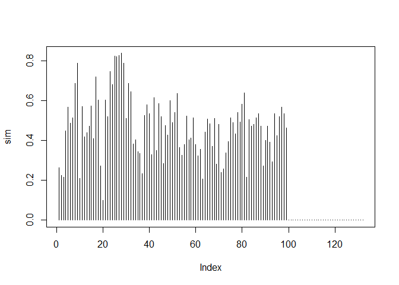
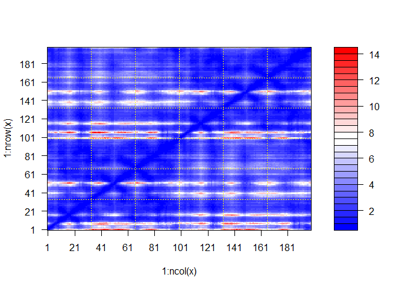
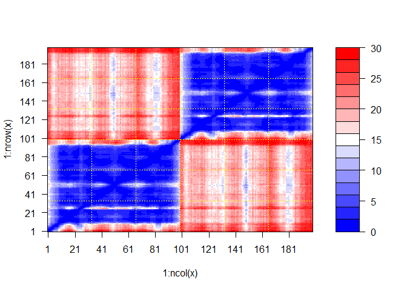

# Class 11: Structural Bioinformatics II
Georgina Canto-Encalada

Alphafold is a cool new bioinformatics method for structure prediction
from sequence.

We can run Alphafold on our own computers by installing it or we can run
on googleColab (without needing t install anything) via:

Return the full file name (i.e with the directory path) of the aligment
file:

``` r
path <- "hiv1dimer_23119/"
aln_files <- list.files(path=path,
                        pattern="*.a3m",
                        full.names = TRUE)

aln_files 
```

    [1] "hiv1dimer_23119/hiv1dimer_23119.a3m"

``` r
library(bio3d)
aln<- read.fasta(aln_files, to.upper=TRUE)
```

    [1] " ** Duplicated sequence id's: 101 **"
    [2] " ** Duplicated sequence id's: 101 **"

``` r
attributes(aln)
```

    $names
    [1] "id"   "ali"  "call"

    $class
    [1] "fasta"

This is a big aligment - almost too big to realy look at:

``` r
dim(aln$ali)
```

    [1] 5378  132

Let’s calculate sum summary info such as conservation scores.

``` r
sim <- conserv(aln)
```

``` r
plot(sim, typ='h')
```



We can summarize these conserved columns (the ones with high scores
above) via a consensus sequence.

``` r
consensus(aln, cutoff=0.9)$seq
```

      [1] "-" "-" "-" "-" "-" "-" "-" "-" "-" "-" "-" "-" "-" "-" "-" "-" "-" "-"
     [19] "-" "-" "-" "-" "-" "-" "D" "T" "G" "A" "-" "-" "-" "-" "-" "-" "-" "-"
     [37] "-" "-" "-" "-" "-" "-" "-" "-" "-" "-" "-" "-" "-" "-" "-" "-" "-" "-"
     [55] "-" "-" "-" "-" "-" "-" "-" "-" "-" "-" "-" "-" "-" "-" "-" "-" "-" "-"
     [73] "-" "-" "-" "-" "-" "-" "-" "-" "-" "-" "-" "-" "-" "-" "-" "-" "-" "-"
     [91] "-" "-" "-" "-" "-" "-" "-" "-" "-" "-" "-" "-" "-" "-" "-" "-" "-" "-"
    [109] "-" "-" "-" "-" "-" "-" "-" "-" "-" "-" "-" "-" "-" "-" "-" "-" "-" "-"
    [127] "-" "-" "-" "-" "-" "-"

Read all our structure models into R

Read the PAE (predicted aligned error files) into R to make sense of
these different multichain models. There are stored as JSON format

``` r
library(jsonlite)
```

    Warning: package 'jsonlite' was built under R version 4.3.3

Find our Json files

``` r
pae.files<-list.files(path=path,
                        pattern="*000.json",
                        full.names = TRUE)
```

``` r
pae5 <- read_json(pae.files[5],simplifyVector = TRUE)
pae1 <- read_json(pae.files[1],simplifyVector = TRUE)
```

``` r
dim(pae1$pae)
```

    [1] 198 198

``` r
plot.dmat(pae1$pae)
```



``` r
plot.dmat(pae5$pae)
```


