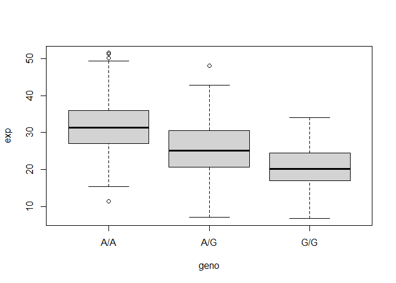

# Class 12: Introduction to Genome Informatics Lab
Georgina Canto-Encalada (A59021295)

# Population Scale Analysis

One sample is obviously not enough to know what is happening in a
population. You are interested in assessing genetic differences on a
population scale. So, you processed about ~230 samples and did the
normalization on a genome level. Now, you want to find whether there is
any association of the 4 asthma-associated SNPs (rs8067378…) on ORMDL3
expression.

This is the final file you got (
https://bioboot.github.io/bggn213_W19/classmaterial/
rs8067378_ENSG00000172057.6.txt ). The first column is sample name, the
second column is genotype and the third column are the expression
values.

Let’s retrieve the data

``` r
data.df <- read.table("rs8067378_ENSG00000172057.6.txt", row.names=1)
```

> Q13: Read this file into R and determine the sample size for each
> genotype and their corresponding median expression levels for each of
> these genotypes.

- Sample size for each genotype:

A/A: 108; A/G: 233; G/G: 121

``` r
table(data.df$geno)
```


    A/A A/G G/G 
    108 233 121 

- Median expression levels for each of these genotypes

A/A: 31.2484 A/G: 25.064 G/G: 20.073

``` r
aggregate(exp~geno,data=data.df,median)
```

      geno      exp
    1  A/A 31.24847
    2  A/G 25.06486
    3  G/G 20.07363

> Q14: Generate a boxplot with a box per genotype, what could you infer
> from the relative expression value between A/A and G/G displayed in
> this plot? Does the SNP effect the expression of ORMDL3?

ANS: We can observe that the expression level of ORMDL3 for A/A is
higher than G/G. This result suggests that A allele could be related
with higher level expression of ORMDL3 when compared to G allele.The
expression levels of ORMDL3 for the A/G heterozygotes is in the midle of
the A/A and G/G expression levels, suggesting that A/G could have a
codominant effect.

``` r
p<-boxplot(exp~geno ,data.df)
```


