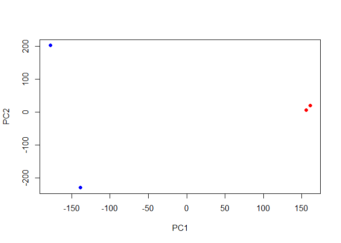

# Class 17: Seq analysis on the cloud
Georgina Canto-Encalada

Where are my files/results?

``` r
library(tximport)

# setup the folder and filenames to read
folders <- dir(pattern="SRR21568*")
samples <- sub("_quant", "", folders)
files <- file.path( folders, "abundance.h5" )
names(files) <- samples
```

``` r
txi.kallisto <- tximport(files, type = "kallisto", txOut = TRUE)
```

    1 2 3 4 

``` r
head(txi.kallisto$counts)
```

                    SRR2156848 SRR2156849 SRR2156850 SRR2156851
    ENST00000539570          0          0    0.00000          0
    ENST00000576455          0          0    2.62037          0
    ENST00000510508          0          0    0.00000          0
    ENST00000474471          0          1    1.00000          0
    ENST00000381700          0          0    0.00000          0
    ENST00000445946          0          0    0.00000          0

We stimated transcript counts for each sample in R. Let’s see how many
transcripts we have for each sample:

``` r
colSums(txi.kallisto$counts)
```

    SRR2156848 SRR2156849 SRR2156850 SRR2156851 
       2563611    2600800    2372309    2111474 

how many transcripts are detected in at least one sample?

``` r
sum(rowSums(txi.kallisto$counts)>0)
```

    [1] 94561

Let’s filter out annotated transcripts with no reads and with no change
over the samples:

``` r
# No reads
to.keep <- rowSums(txi.kallisto$counts) > 0
kset.nonzero <- txi.kallisto$counts[to.keep,]

# No change (eliminating transripts with SD less than 0)
keep2 <- apply(kset.nonzero,1,sd)>0
x <- kset.nonzero[keep2,]
```

# PCA

``` r
pca <- prcomp(t(x), scale=TRUE)
summary(pca)
```

    Importance of components:
                                PC1      PC2      PC3   PC4
    Standard deviation     183.6379 177.3605 171.3020 1e+00
    Proportion of Variance   0.3568   0.3328   0.3104 1e-05
    Cumulative Proportion    0.3568   0.6895   1.0000 1e+00

Now we can use the first two principal components as a co-ordinate
system for visualizing the summarized transcriptomic profiles of each
sample:

``` r
plot(pca$x[,1], pca$x[,2],
     col=c("blue","blue","red","red"),
     xlab="PC1", ylab="PC2", pch=16)
```



Q. Use ggplot to make a similar figure of PC1 vs PC2 and a seperate
figure PC1 vs PC3 and PC2 vs PC3.

``` r
library(ggplot2)
library(ggrepel)

samp=colnames(txi.kallisto$counts)
con=c("control","control","treatment","treatment")
metadata<-data.frame(cbind(samp,con))

pca.df<- data.frame(pca$x)
pca.df$condition<-metadata$con
ggplot(pca.df, aes(x=PC1,y=PC2,col=condition)) + geom_point() + 
  geom_text_repel(label=metadata$samp)
```


``` r
ggplot(pca.df, aes(x=PC1,y=PC3,col=condition)) + geom_point() + 
  geom_text_repel(label=metadata$samp)
```


``` r
ggplot(pca.df, aes(x=PC2,y=PC3,col=condition)) + geom_point() + 
  geom_text_repel(label=metadata$samp)
```


We can observe that PC1 is separating controls and treatments while PC2
is separating the controls.PC3 separates the two enhancer-targeting
CRISPR samples from each other.
