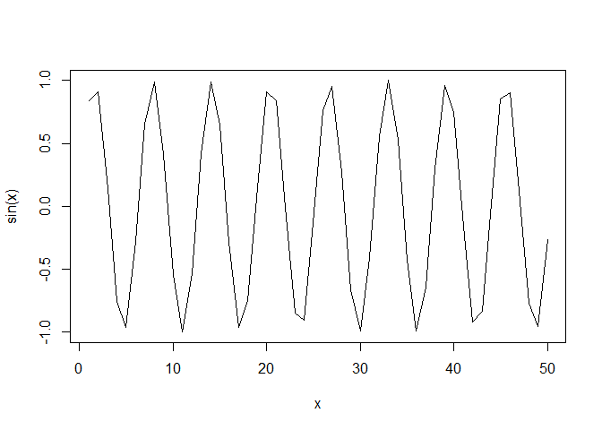
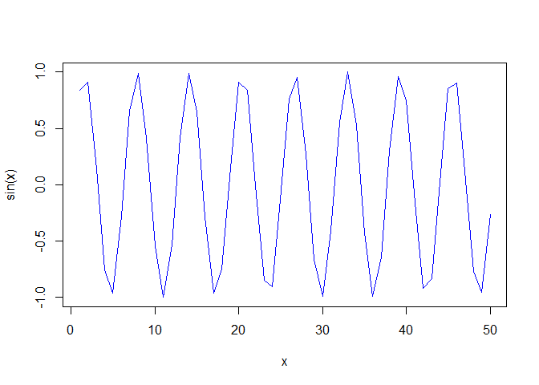
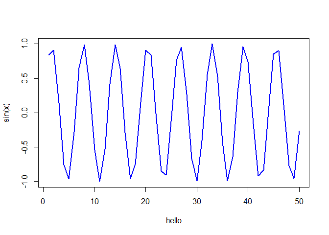

# Class 4: Bioinformatics data analysis with R
Georgina Canto-Encalada

``` r
#This is just a text file
x<-1:50
plot(x,sin(x))
```


``` r
plot(x,sin(x),typ = "l")
```



``` r
plot(x,sin(x),typ = "l",col="blue")
```



``` r
plot(x,sin(x),typ = "l",col="blue",lwd=2, xlab="hello")
```


