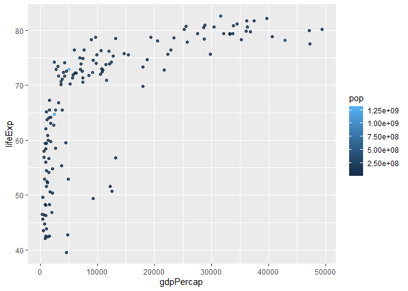
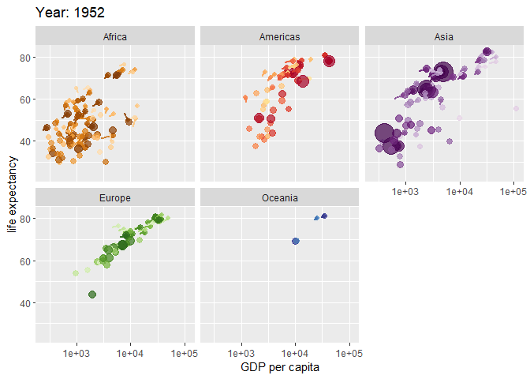

# Class 5: Data Viz with ggplot
Georgina Canto-Encalada (A59021295)
2024-01-24

# Graphics systems in R

**Q1.** For which phases is data visualization important in our
scientific workflows?

Ans = Communication of results, Exploratory Data Analysis (EDA), and
detection of outliers

**Q2.** True or False? The ggplot2 package comes already installed with
R

Ans = False

**Q3.** Which plot types are typically NOT used to compare distributions
of numeric variables?

Network graphs

**Q4.** Which statement about data visualization with ggplot2 is
incorrect?

ggplot2 is the only way to create plots in R

**Q5.** Which geometric layer should be used to create scatter plots in
ggplot2?

geom_point()

There are many graphics systems for R. These include so-called *“base
R”* and those in add-on packages like `ggplot2`

``` r
plot(cars)
```


How can we make this with `ggplot2`

This is an add-on package and I first need to install it on my computer.
This install is a one time only deal

To install any package I used the `install.package()` function. To use
it we need to load up the package from pur library of install packages.
For this I use `library(ggplot2)`

``` r
#install.package("ggplot2")
library(ggplot2)
ggplot(cars)
```


Using ggplot is not as straightforward as base R plot for basic plots. I
have some more typing to do.

Every ggplot has at least 3 things (layer): -**data**(data.frame)
-**aes** (how the data map to the plot) -**geoms** (think of this as the
type of plot, e.g. points, lines, etc.)

``` r
ggplot(cars)+
  aes(x=speed,y=dist)+
  geom_point()
```


Here ggplot was more verbose - i.e. I had more typing to do - than base
R. However, I can add more layers to make nicer and more complicated
plots in easy way with ggplot

``` r
ggplot(cars)+
  aes(speed,dist)+
  geom_point()+
  geom_smooth()+
  labs(title = "Stopping Distance of Old Cars") + 
  theme_bw()
```

    `geom_smooth()` using method = 'loess' and formula = 'y ~ x'


``` r
pl<-ggplot(cars)+
  aes(speed,dist)+
  geom_point()

pl
```


``` r
pl + geom_smooth(method = "lm", se = TRUE)
```

    `geom_smooth()` using formula = 'y ~ x'


``` r
library(patchwork)
(pl|pl)/(pl|pl)
```


\##Lab sheet section 6 onward

``` r
url <- "https://bioboot.github.io/bimm143_S20/class-material/up_down_expression.txt"
genes <- read.delim(url)
head(genes)
```

            Gene Condition1 Condition2      State
    1      A4GNT -3.6808610 -3.4401355 unchanging
    2       AAAS  4.5479580  4.3864126 unchanging
    3      AASDH  3.7190695  3.4787276 unchanging
    4       AATF  5.0784720  5.0151916 unchanging
    5       AATK  0.4711421  0.5598642 unchanging
    6 AB015752.4 -3.6808610 -3.5921390 unchanging

**Q.** Use the nrow() function to find out how many genes are in this
dataset. What is your answer?

``` r
nrow(genes)
```

    [1] 5196

**Q.** Use the colnames() function and the ncol() function on the genes
data frame to find out what the column names are (we will need these
later) and how many columns there are. How many columns did you find?

``` r
ncol(genes)
```

    [1] 4

``` r
colnames(genes)
```

    [1] "Gene"       "Condition1" "Condition2" "State"     

``` r
table(genes$State)
```


          down unchanging         up 
            72       4997        127 

**Q.** Use the table() function on the State column of this data.frame
to find out how many ‘up’ regulated genes there are. What is your
answer?

``` r
table(genes$State)
```


          down unchanging         up 
            72       4997        127 

**Q.** Using your values above and 2 significant figures. What fraction
of total genes is up-regulated in this dataset?

``` r
round(table(genes$State)/nrow(genes)*100,2)
```


          down unchanging         up 
          1.39      96.17       2.44 

We can make a first basic scatter plot of this dataset by following the
same recipe we have already seen, namely:

- Pass the genes data.frame as input to the ggplot() function.
- Then use the aes() function to set the x and y aesthetic mappings to
  the Condition1 and Condition2 columns.
- Add a geom_point() layer to add points to the plot.
- use the aes() function to Add color to the points based on the
  regulation state of the genes
- use the aes() function to assign the name of each point as gene

``` r
p=ggplot(genes) + 
  aes(x=Condition1, y=Condition2, col=State, name=Gene) +
  geom_point()
p
```


Let’s chage the color of the points by adding another layer to
explicitly specify our color scale. Moreover, we will add the axis names
and the tittle of the chart

``` r
p2<-p+ scale_colour_manual( values=c("blue","gray","red") ) + 
  labs(title= "Gene Expression Changes",x="Control (no drug)", y="Drug treatment")
p2
```


In order to inspect the data in the graphs, we have to use `ggplotly`
function which is included in the `plotly` package

``` r
library(plotly)
```

``` r
#ggplotly(p2)
```

The gapminder dataset contains economic and demographic data about
various countries since 1952

``` r
# File location online
url <- "https://raw.githubusercontent.com/jennybc/gapminder/master/inst/extdata/gapminder.tsv"


gapminder <- read.delim(url)

#| message: false
library(dplyr)
```


    Attaching package: 'dplyr'

    The following objects are masked from 'package:stats':

        filter, lag

    The following objects are masked from 'package:base':

        intersect, setdiff, setequal, union

``` r
# Let's take gapmider data frame and filter it to contain only the rows with a year value of 2007.
gapminder_2007 <- gapminder %>% filter(year==2007)
head(gapminder_2007)
```

          country continent year lifeExp      pop  gdpPercap
    1 Afghanistan      Asia 2007  43.828 31889923   974.5803
    2     Albania    Europe 2007  76.423  3600523  5937.0295
    3     Algeria    Africa 2007  72.301 33333216  6223.3675
    4      Angola    Africa 2007  42.731 12420476  4797.2313
    5   Argentina  Americas 2007  75.320 40301927 12779.3796
    6   Australia   Oceania 2007  81.235 20434176 34435.3674

``` r
# Let's produce a first basic scatter plot of this gapminder_2007 dataset adding a transparency of 0.5 in the points:
ggplot(gapminder_2007) +
  aes(x=gdpPercap, y=lifeExp) +
  geom_point(alpha=0.5)
```


### Adding more variables to aes()

By mapping the continent variable to the point color aesthetic and the
population pop (in millions) through the point size argument to aes() we
can obtain a much richer plot that now includes 4 different variables
from the data set:

``` r
ggplot(gapminder_2007) +
  aes(x=gdpPercap, y=lifeExp, col=continent, size=pop) +
  geom_point(alpha=0.5)
```


Change colors based on population instead of continent

``` r
ggplot(gapminder_2007) +
  aes(x=gdpPercap, y=lifeExp, col=pop) +
  geom_point(alpha=0.8)
```



\##Adjusting point size

``` r
ggplot(gapminder_2007) + 
  aes(x = gdpPercap, y = lifeExp, size = pop) +
  geom_point(alpha=0.5)
```


To reflect the actual population differences by the point size we can
use the scale_size_area() function instead. The scaling information can
be added like any other ggplot object with the + operator:

``` r
ggplot(gapminder_2007) + 
  geom_point(aes(x = gdpPercap, y = lifeExp,
                 size = pop), alpha=0.5) + 
  scale_size_area(max_size = 10)
```


### Doing the same but with year 1957

``` r
gapminder_1957 <- gapminder %>% filter(year==1957)
ggplot(gapminder_1957) + 
  aes(x = gdpPercap, y = lifeExp, size = pop) +
  geom_point(alpha=0.5)
```


Let’s do the same again but including 1957 and 2007 in your input
dataset for ggplot(). We should now include the layer facet_wrap(~year)
to separate the graphs

``` r
gapminder_1957_2007 <- gapminder %>% filter(year==1957 | year==2007)
ggplot(gapminder_1957_2007) + 
  geom_point(aes(x = gdpPercap, y = lifeExp, color=continent,
                 size = pop), alpha=0.7) + 
  scale_size_area(max_size = 10) +
  facet_wrap(~year)
```


# Bar Charts

Let’s take information of number of people (in millions) in the five
biggest countries by population in 2007:

``` r
gapminder_top5 <- gapminder %>% 
  # filter the data by the year 2007
  filter(year==2007) %>% 
  #Arrange the data in descending order by population 
  arrange(desc(pop)) %>% 
  #Select just the top 5 values of population
  top_n(5, pop)

gapminder_top5
```

            country continent year lifeExp        pop gdpPercap
    1         China      Asia 2007  72.961 1318683096  4959.115
    2         India      Asia 2007  64.698 1110396331  2452.210
    3 United States  Americas 2007  78.242  301139947 42951.653
    4     Indonesia      Asia 2007  70.650  223547000  3540.652
    5        Brazil  Americas 2007  72.390  190010647  9065.801

Create a simple bar graph

``` r
ggplot(gapminder_top5) + 
  geom_col(aes(x = country, y = pop))
```


Create a bar chart showing the life expectancy of the five biggest
countries by population in 2007.

``` r
ggplot(gapminder_top5) + 
  geom_col(aes(x = country, y = lifeExp))
```


Based on the gapminder_top5 dataset we plot the population (in millions)
of the biggest countries and use the continent variable to color each
bar:

``` r
ggplot(gapminder_top5) + 
  geom_col(aes(x = country, y = pop, fill = continent))
```


Since the continent variable is a categorical variable the bars have a
clear color scheme for each continent. Let’s see what happens if we use
a numeric variable like life expectancy lifeExp instead:

``` r
ggplot(gapminder_top5) + 
  geom_col(aes(x = country, y = pop, fill = lifeExp))
```


Plot population size by country. Create a bar chart showing the
population (in millions) of the five biggest countries by population in
2007. Add a color scheme based on GDP per capita

``` r
ggplot(gapminder_top5) + 
  geom_col(aes(x = country, y = pop, fill=gdpPercap))
```


And change the order of the bars

``` r
ggplot(gapminder_top5) +
  aes(x=reorder(country, -pop), y=pop, fill=gdpPercap) +
  geom_col()
```


and just fill by country

``` r
ggplot(gapminder_top5) +
  aes(x=reorder(country, -pop), y=pop, fill=country) +
  #Add gray color to the outline
  geom_col(col="gray30") +
  #Remove the legend for the fill aesthetic
  guides(fill="none")
```


# Flipping bar charts

In some circumstances it might be useful to rotate (or “flip”) your
plots to enable a more clear visualization. For this we can use the
coord_flip() function. Lets look at an example considering arrest data
in US states. This is another inbult dataset called USArrests.

``` r
head(USArrests)
```

               Murder Assault UrbanPop Rape
    Alabama      13.2     236       58 21.2
    Alaska       10.0     263       48 44.5
    Arizona       8.1     294       80 31.0
    Arkansas      8.8     190       50 19.5
    California    9.0     276       91 40.6
    Colorado      7.9     204       78 38.7

``` r
USArrests$State <- rownames(USArrests)
ggplot(USArrests) +
  aes(x=reorder(State,Murder), y=Murder) +
  geom_col() +
  coord_flip()
```


Hmm… this is too crowded for an effective display in small format. Let’s
try an alternative custom visualization by combining geom_point() and
geom_segment():

``` r
ggplot(USArrests) +
  aes(x=reorder(State,Murder), y=Murder) +
  geom_point() +
  geom_segment(aes(x=State, 
                   xend=State, 
                   y=0, 
                   yend=Murder), color="blue") +
  coord_flip()
```


# Extensions: Animation

Lets play with one for making animated plots called gganimate. We will
first need to install this package

``` r
#install.packages("gifski")
#install.packages("gganimate"))
#| message: false
library(gapminder)
```


    Attaching package: 'gapminder'

    The following object is masked _by_ '.GlobalEnv':

        gapminder

``` r
library(gganimate)

# Setup nice regular ggplot of the gapminder data
ggplot(gapminder, aes(gdpPercap, lifeExp, size = pop, colour = country)) +
  geom_point(alpha = 0.7, show.legend = FALSE) +
  scale_colour_manual(values = country_colors) +
  scale_size(range = c(2, 12)) +
  scale_x_log10() +
  # Facet by continent
  facet_wrap(~continent) +
  # Here comes the gganimate specific bits
  labs(title = 'Year: {frame_time}', x = 'GDP per capita', y = 'life expectancy') +
  transition_time(year) +
  shadow_wake(wake_length = 0.1, alpha = FALSE)
```



``` r
# Combining plots
#| message: false
library(patchwork)

# Setup some example plots 
p1 <- ggplot(mtcars) + geom_point(aes(mpg, disp))
p2 <- ggplot(mtcars) + geom_boxplot(aes(gear, disp, group = gear))
p3 <- ggplot(mtcars) + geom_smooth(aes(disp, qsec))
p4 <- ggplot(mtcars) + geom_bar(aes(carb))

# Use patchwork to combine them here:
(p1 | p2 | p3) /
      p4
```

    `geom_smooth()` using method = 'loess' and formula = 'y ~ x'


