# Class 9: Halloween mini-project
Georgina Canto-Encalada (A59021295)

# 1. Importing candy data

Today we will analyze some data from 538 about typical Halloween candy.

Our first job is to get the data an read it into R

``` r
candy <-read.csv("candy-data.csv",row.names=1)
head(candy)
```

                 chocolate fruity caramel peanutyalmondy nougat crispedricewafer
    100 Grand            1      0       1              0      0                1
    3 Musketeers         1      0       0              0      1                0
    One dime             0      0       0              0      0                0
    One quarter          0      0       0              0      0                0
    Air Heads            0      1       0              0      0                0
    Almond Joy           1      0       0              1      0                0
                 hard bar pluribus sugarpercent pricepercent winpercent
    100 Grand       0   1        0        0.732        0.860   66.97173
    3 Musketeers    0   1        0        0.604        0.511   67.60294
    One dime        0   0        0        0.011        0.116   32.26109
    One quarter     0   0        0        0.011        0.511   46.11650
    Air Heads       0   0        0        0.906        0.511   52.34146
    Almond Joy      0   1        0        0.465        0.767   50.34755

> Q1. How many different candy types are in this dataset?

ANS: There are 85 different candy types

``` r
nrow(candy)
```

    [1] 85

> Q. How many chocolate candy types are in this dataset?

``` r
sum(candy$chocolate)
```

    [1] 37

> Q2. How many fruity candy types are in the dataset?

ANS: There are 38 fruity candies\`

``` r
sum(candy$fruity)
```

    [1] 38

> Q. How many total candy?

``` r
nrow(candy)
```

    [1] 85

> Q. How many variables/dimensions are there?

``` r
ncol(candy)
```

    [1] 12

# What is your favorate candy?

## Data Exploration

Folks like the skimr package for a first wee peak into a new dataset,
Let’s see what it does for this candy dataset

> Q3. What is your favorite candy in the dataset and what is it’s
> winpercent value?

ANS: My favorite candy is Snickers and its winpercent value is 76.67%

``` r
candy["Snickers",]$winpercent
```

    [1] 76.67378

> Q4. What is the winpercent value for “Kit Kat”?

ANS: 76.76%

``` r
candy["Kit Kat",]$winpercent
```

    [1] 76.7686

> Q6. Is there any variable/column that looks to be on a different scale
> to the majority of the other columns in the dataset?

Yes, the winpercent column

``` r
library("skimr")
skimr::skim(candy)
```

|                                                  |       |
|:-------------------------------------------------|:------|
| Name                                             | candy |
| Number of rows                                   | 85    |
| Number of columns                                | 12    |
| \_\_\_\_\_\_\_\_\_\_\_\_\_\_\_\_\_\_\_\_\_\_\_   |       |
| Column type frequency:                           |       |
| numeric                                          | 12    |
| \_\_\_\_\_\_\_\_\_\_\_\_\_\_\_\_\_\_\_\_\_\_\_\_ |       |
| Group variables                                  | None  |

Data summary

**Variable type: numeric**

| skim_variable    | n_missing | complete_rate |  mean |    sd |    p0 |   p25 |   p50 |   p75 |  p100 | hist  |
|:-----------------|----------:|--------------:|------:|------:|------:|------:|------:|------:|------:|:------|
| chocolate        |         0 |             1 |  0.44 |  0.50 |  0.00 |  0.00 |  0.00 |  1.00 |  1.00 | ▇▁▁▁▆ |
| fruity           |         0 |             1 |  0.45 |  0.50 |  0.00 |  0.00 |  0.00 |  1.00 |  1.00 | ▇▁▁▁▆ |
| caramel          |         0 |             1 |  0.16 |  0.37 |  0.00 |  0.00 |  0.00 |  0.00 |  1.00 | ▇▁▁▁▂ |
| peanutyalmondy   |         0 |             1 |  0.16 |  0.37 |  0.00 |  0.00 |  0.00 |  0.00 |  1.00 | ▇▁▁▁▂ |
| nougat           |         0 |             1 |  0.08 |  0.28 |  0.00 |  0.00 |  0.00 |  0.00 |  1.00 | ▇▁▁▁▁ |
| crispedricewafer |         0 |             1 |  0.08 |  0.28 |  0.00 |  0.00 |  0.00 |  0.00 |  1.00 | ▇▁▁▁▁ |
| hard             |         0 |             1 |  0.18 |  0.38 |  0.00 |  0.00 |  0.00 |  0.00 |  1.00 | ▇▁▁▁▂ |
| bar              |         0 |             1 |  0.25 |  0.43 |  0.00 |  0.00 |  0.00 |  0.00 |  1.00 | ▇▁▁▁▂ |
| pluribus         |         0 |             1 |  0.52 |  0.50 |  0.00 |  0.00 |  1.00 |  1.00 |  1.00 | ▇▁▁▁▇ |
| sugarpercent     |         0 |             1 |  0.48 |  0.28 |  0.01 |  0.22 |  0.47 |  0.73 |  0.99 | ▇▇▇▇▆ |
| pricepercent     |         0 |             1 |  0.47 |  0.29 |  0.01 |  0.26 |  0.47 |  0.65 |  0.98 | ▇▇▇▇▆ |
| winpercent       |         0 |             1 | 50.32 | 14.71 | 22.45 | 39.14 | 47.83 | 59.86 | 84.18 | ▃▇▆▅▂ |

> Q7. What do you think a zero and one represent for the
> candy\$chocolate column?

Zero represents the abscense of chocolate in a specific candy, while 1
means that the candy has chocolate.

> Q. What are the five least liked candy’s in the dataset?

``` r
inds<-order(candy$winpercent)
head(candy[inds,],5)
```

                       chocolate fruity caramel peanutyalmondy nougat
    Nik L Nip                  0      1       0              0      0
    Boston Baked Beans         0      0       0              1      0
    Chiclets                   0      1       0              0      0
    Super Bubble               0      1       0              0      0
    Jawbusters                 0      1       0              0      0
                       crispedricewafer hard bar pluribus sugarpercent pricepercent
    Nik L Nip                         0    0   0        1        0.197        0.976
    Boston Baked Beans                0    0   0        1        0.313        0.511
    Chiclets                          0    0   0        1        0.046        0.325
    Super Bubble                      0    0   0        0        0.162        0.116
    Jawbusters                        0    1   0        1        0.093        0.511
                       winpercent
    Nik L Nip            22.44534
    Boston Baked Beans   23.41782
    Chiclets             24.52499
    Super Bubble         27.30386
    Jawbusters           28.12744

``` r
tail(candy[inds,],5)
```

                              chocolate fruity caramel peanutyalmondy nougat
    Snickers                          1      0       1              1      1
    Kit Kat                           1      0       0              0      0
    Twix                              1      0       1              0      0
    Reese's Miniatures                1      0       0              1      0
    Reese's Peanut Butter cup         1      0       0              1      0
                              crispedricewafer hard bar pluribus sugarpercent
    Snickers                                 0    0   1        0        0.546
    Kit Kat                                  1    0   1        0        0.313
    Twix                                     1    0   1        0        0.546
    Reese's Miniatures                       0    0   0        0        0.034
    Reese's Peanut Butter cup                0    0   0        0        0.720
                              pricepercent winpercent
    Snickers                         0.651   76.67378
    Kit Kat                          0.511   76.76860
    Twix                             0.906   81.64291
    Reese's Miniatures               0.279   81.86626
    Reese's Peanut Butter cup        0.651   84.18029

> Q8. Plot a histogram of winpercent values

``` r
hist(candy$winpercent)
```


> Q9. Is the distribution of winpercent values symmetrical?

ANS: No

> Q10. Is the center of the distribution above or below 50%?

ANS: Below 50%

``` r
median(candy$winpercent)
```

    [1] 47.82975

> Q11. On average is chocolate candy higher or lower ranked than fruit
> candy?

ANS: Higher ranked

- First find all chocolate candy(subset)
- Get their winpercent values
- Summarize these values into one metric

-Do the same for fruity candy and compare

``` r
idx<-candy$chocolate==1
choco_data<-candy[idx,]
mean_choco<-mean(choco_data$winpercent)
mean_choco
```

    [1] 60.92153

``` r
idx<-candy$fruity==1
fruity_data<-candy[idx,]
mean_fruity<-mean(fruity_data$winpercent)
mean_fruity
```

    [1] 44.11974

> Q12. Is this difference statistically significant?

ANS: Yes

``` r
t.test(choco_data$winpercent,fruity_data$winpercent)
```


        Welch Two Sample t-test

    data:  choco_data$winpercent and fruity_data$winpercent
    t = 6.2582, df = 68.882, p-value = 2.871e-08
    alternative hypothesis: true difference in means is not equal to 0
    95 percent confidence interval:
     11.44563 22.15795
    sample estimates:
    mean of x mean of y 
     60.92153  44.11974 

# Overall Candy Rankings

> Q13. What are the five least liked candy types in this set?

ANS: Nik L Nip, Boston Baked Beans, Chiclets, Super Bubble and
Jawbusters

``` r
head(candy[order(candy$winpercent),], n=5)
```

                       chocolate fruity caramel peanutyalmondy nougat
    Nik L Nip                  0      1       0              0      0
    Boston Baked Beans         0      0       0              1      0
    Chiclets                   0      1       0              0      0
    Super Bubble               0      1       0              0      0
    Jawbusters                 0      1       0              0      0
                       crispedricewafer hard bar pluribus sugarpercent pricepercent
    Nik L Nip                         0    0   0        1        0.197        0.976
    Boston Baked Beans                0    0   0        1        0.313        0.511
    Chiclets                          0    0   0        1        0.046        0.325
    Super Bubble                      0    0   0        0        0.162        0.116
    Jawbusters                        0    1   0        1        0.093        0.511
                       winpercent
    Nik L Nip            22.44534
    Boston Baked Beans   23.41782
    Chiclets             24.52499
    Super Bubble         27.30386
    Jawbusters           28.12744

> Q14. What are the top 5 all time favorite candy types out of this
> set?’

ANS: Snickers, Kit Kat, Twix, Reese’s Miniatures, Reese’s Peanut Butter
cup

``` r
tail(candy[order(candy$winpercent),], n=5)
```

                              chocolate fruity caramel peanutyalmondy nougat
    Snickers                          1      0       1              1      1
    Kit Kat                           1      0       0              0      0
    Twix                              1      0       1              0      0
    Reese's Miniatures                1      0       0              1      0
    Reese's Peanut Butter cup         1      0       0              1      0
                              crispedricewafer hard bar pluribus sugarpercent
    Snickers                                 0    0   1        0        0.546
    Kit Kat                                  1    0   1        0        0.313
    Twix                                     1    0   1        0        0.546
    Reese's Miniatures                       0    0   0        0        0.034
    Reese's Peanut Butter cup                0    0   0        0        0.720
                              pricepercent winpercent
    Snickers                         0.651   76.67378
    Kit Kat                          0.511   76.76860
    Twix                             0.906   81.64291
    Reese's Miniatures               0.279   81.86626
    Reese's Peanut Butter cup        0.651   84.18029

Plots of overall candy rankings

> Q15. Make a first barplot of candy ranking based on winpercent values.

``` r
library(ggplot2)
ggplot(candy) + 
  aes(winpercent, rownames(candy)) +
  geom_col()
```


Q16. This is quite ugly, use the reorder() function to get the bars
sorted by winpercent?

``` r
ggplot(candy) + 
  aes(winpercent, reorder(rownames(candy),winpercent)) +
  geom_col()
```


``` r
ggplot(candy) + 
  aes(winpercent, reorder(rownames(candy),winpercent)) +
  geom_col()+
  labs(x="Matchup Win Percent",y=NULL)
```

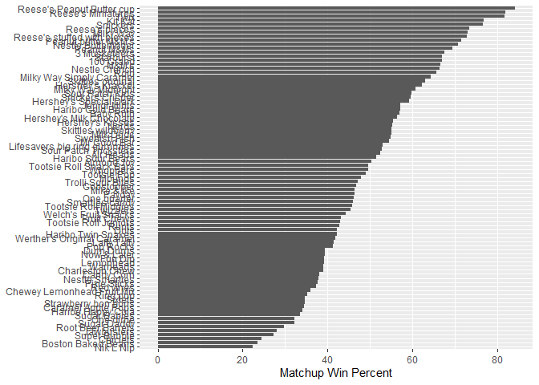

``` r
ggsave("barplot.png",h=10,width=7)
```

we can now insert any image using markdown syntax. This is ! followed by
square brackets and then normal brackets. The result is shown as
[Figure 1](#fig-gray)

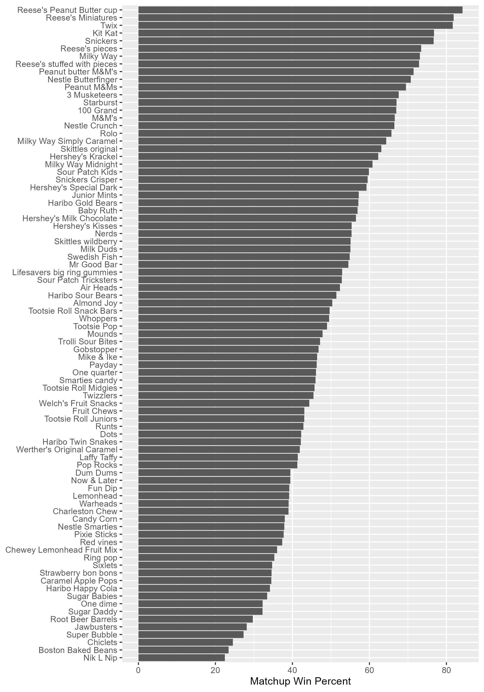

# Time to add some useful color

``` r
ggplot(candy) + 
  aes(winpercent, reorder(rownames(candy),winpercent),fill=as.factor(chocolate)) +
  geom_col()+
  labs(x="Matchup Win Percent",y=NULL)
```

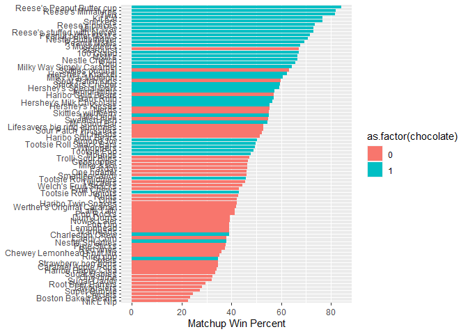

We need to make our own color vector with the colors we like

``` r
my_cols<-rep("black",nrow(candy))
my_cols[as.logical(candy$chocolate)] <- "chocolate"
my_cols[as.logical(candy$bar)] <- "brown"
my_cols[as.logical(candy$fruity)] <- "pink"
```

``` r
ggplot(candy) + 
  aes(winpercent, reorder(rownames(candy),winpercent)) +
  geom_col(fill=my_cols)+
  labs(x="Matchup Win Percent",y=NULL)
```

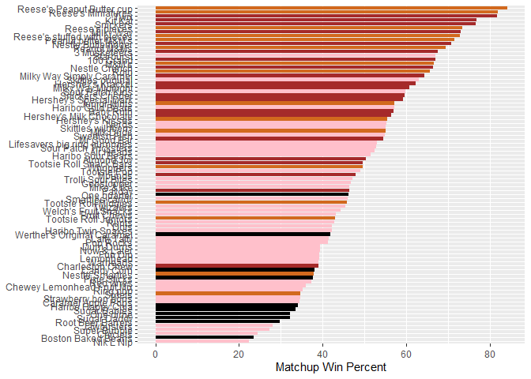

``` r
ggsave("barplot2.png",h=10,width=7)
```

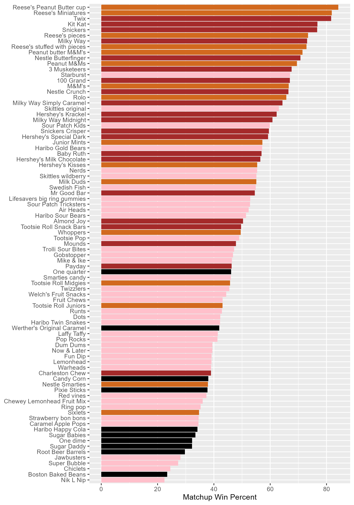

> Q17. What is the worst ranked chocolate candy?

ANS: Sixlets

> Q18. What is the best ranked fruity candy?

ANS: Starburst

# Taking a look at pricepercent

As shown in {[Figure 2](#fig-bar)} there is some ugly ass colors to pick
from in R. This is better than {[Figure 1](#fig-gray)}

Let’s male a plot of winpercent vs pricepercent. The original idea with
this 538 plot was to show you the best candy to get for your money as
your shop for halloween

``` r
ggplot(candy)+
  aes(winpercent,pricepercent,label=rownames(candy))+
  geom_point(col=my_cols)+
  geom_text(col=my_cols)
```

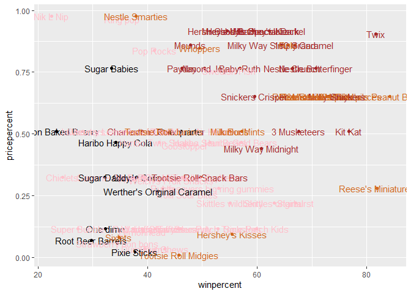

These labels suck. Let’s try ggrepel.

``` r
library(ggrepel)

my_cols[as.logical(candy$fruity)] <- "red"
ggplot(candy) +
  aes(winpercent, pricepercent, label=rownames(candy)) +
  geom_point(col=my_cols) + 
  geom_text_repel(col=my_cols, size=3.3, max.overlaps = 10)
```

    Warning: ggrepel: 21 unlabeled data points (too many overlaps). Consider
    increasing max.overlaps

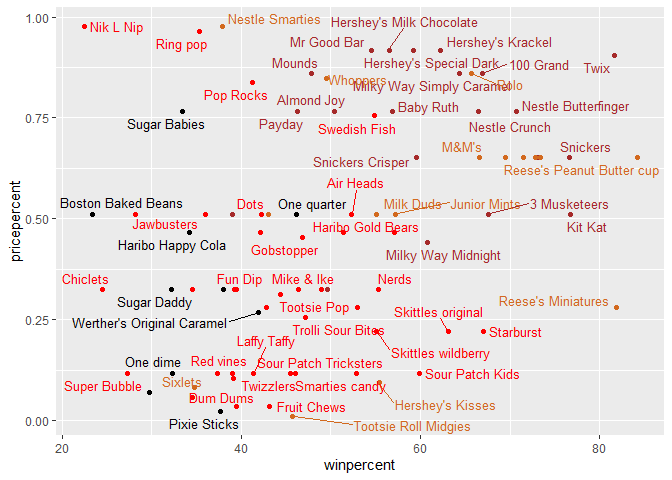

> Q19. Which candy type is the highest ranked in terms of winpercent for
> the least money - i.e. offers the most bang for your buck?

ANS: Reese’s Miniatures

> Q20. What are the top 5 most expensive candy types in the dataset and
> of these which is the least popular?

ANS: 5 Most expensive: Nik L Nip, Nestle smarties, Ring pop, Mr Good
Bar, Hershey’s Special Dark. The least popular is Nik L Nip.

## Explore the correlation structure in candy data

We will calculate all Pearson correlation values

``` r
library(corrplot)
```

    corrplot 0.92 loaded

``` r
cij<-cor(candy)
head(cij)
```

                      chocolate     fruity     caramel peanutyalmondy      nougat
    chocolate         1.0000000 -0.7417211  0.24987535     0.37782357  0.25489183
    fruity           -0.7417211  1.0000000 -0.33548538    -0.39928014 -0.26936712
    caramel           0.2498753 -0.3354854  1.00000000     0.05935614  0.32849280
    peanutyalmondy    0.3778236 -0.3992801  0.05935614     1.00000000  0.21311310
    nougat            0.2548918 -0.2693671  0.32849280     0.21311310  1.00000000
    crispedricewafer  0.3412098 -0.2693671  0.21311310    -0.01764631 -0.08974359
                     crispedricewafer       hard        bar   pluribus sugarpercent
    chocolate              0.34120978 -0.3441769  0.5974211 -0.3396752   0.10416906
    fruity                -0.26936712  0.3906775 -0.5150656  0.2997252  -0.03439296
    caramel                0.21311310 -0.1223551  0.3339600 -0.2695850   0.22193335
    peanutyalmondy        -0.01764631 -0.2055566  0.2604196 -0.2061093   0.08788927
    nougat                -0.08974359 -0.1386750  0.5229764 -0.3103388   0.12308135
    crispedricewafer       1.00000000 -0.1386750  0.4237509 -0.2246934   0.06994969
                     pricepercent winpercent
    chocolate           0.5046754  0.6365167
    fruity             -0.4309685 -0.3809381
    caramel             0.2543271  0.2134163
    peanutyalmondy      0.3091532  0.4061922
    nougat              0.1531964  0.1993753
    crispedricewafer    0.3282654  0.3246797

``` r
corrplot(cij)
```


> Q22. Examining this plot what two variables are anti-correlated
> (i.e. have minus values)?

ANS: Chocolate and fruity

> Q23. Similarly, what two variables are most positively correlated?

ANS: winpercent and chocolate

# Principal Component Analysis

``` r
pca <- prcomp(candy,scale=TRUE)
summary(pca)
```

    Importance of components:
                              PC1    PC2    PC3     PC4    PC5     PC6     PC7
    Standard deviation     2.0788 1.1378 1.1092 1.07533 0.9518 0.81923 0.81530
    Proportion of Variance 0.3601 0.1079 0.1025 0.09636 0.0755 0.05593 0.05539
    Cumulative Proportion  0.3601 0.4680 0.5705 0.66688 0.7424 0.79830 0.85369
                               PC8     PC9    PC10    PC11    PC12
    Standard deviation     0.74530 0.67824 0.62349 0.43974 0.39760
    Proportion of Variance 0.04629 0.03833 0.03239 0.01611 0.01317
    Cumulative Proportion  0.89998 0.93832 0.97071 0.98683 1.00000

``` r
attributes(pca)
```

    $names
    [1] "sdev"     "rotation" "center"   "scale"    "x"       

    $class
    [1] "prcomp"

``` r
plot(pca$x[,1], pca$x[,2])
```

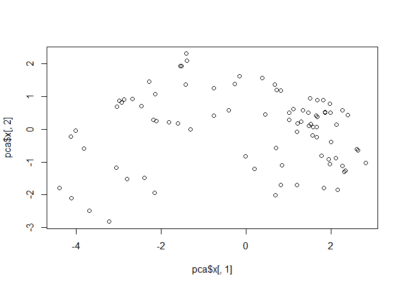

We can change the plotting character and add some color:

``` r
plot(pca$x[,1:2], col=my_cols, pch=16)
```

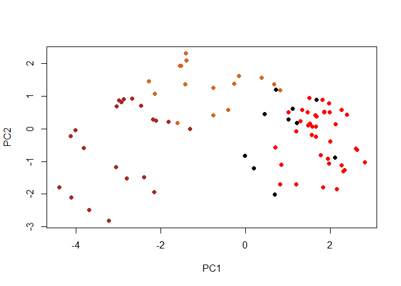

Let’s make a nicer graph using ggplot

``` r
pc.score.results<-as.data.frame(pca$x)
ggplot(pc.score.results)+
  aes(PC1,PC2,label=rownames(pc.score.results))+
  geom_point(col=my_cols)+
  geom_text_repel(col=my_cols,max.overlaps=8)+
  labs(title="PCA Candy Space", subtitle="Chocolate and fruity candy separation")
```

    Warning: ggrepel: 42 unlabeled data points (too many overlaps). Consider
    increasing max.overlaps

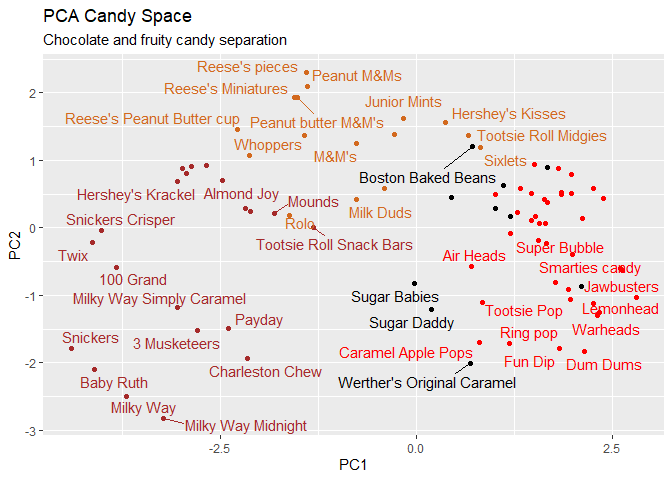

loadings plot

``` r
pc.loadings<-as.data.frame(pca$rotation)

ggplot(pc.loadings) + 
  aes(PC1,reorder(rownames(pc.loadings),PC1))+
  geom_col()
```

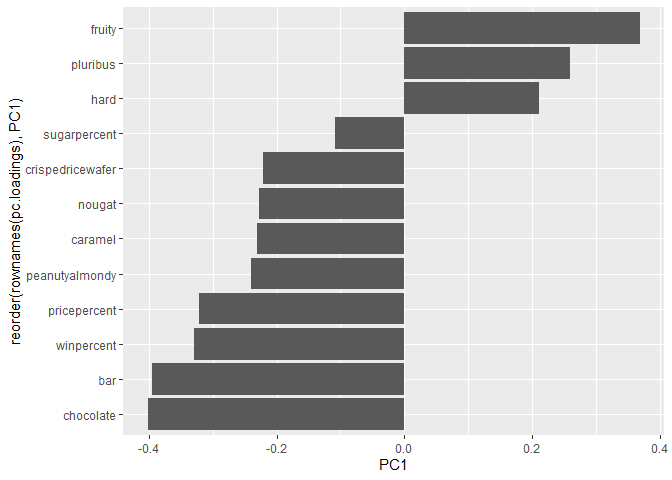

> Q24. What original variables are picked up strongly by PC1 in the
> positive direction? Do these make sense to you?

ANS: Fruity, pluribus, hard. It makes sense since most of the fruity
candy are hard and are sold in a pluribus presentation.
